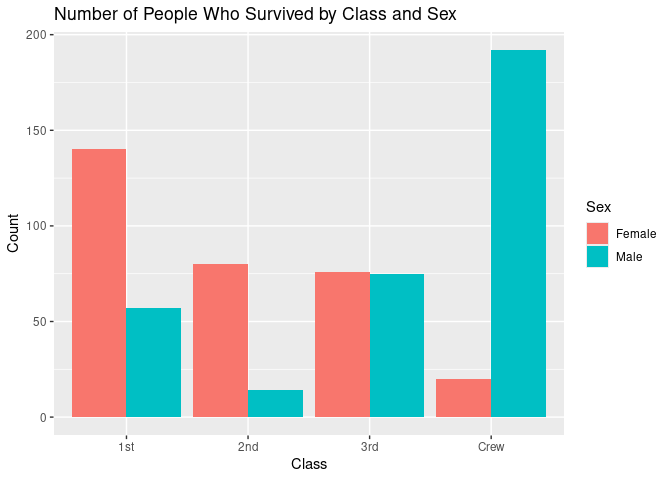
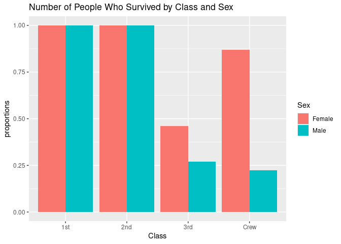
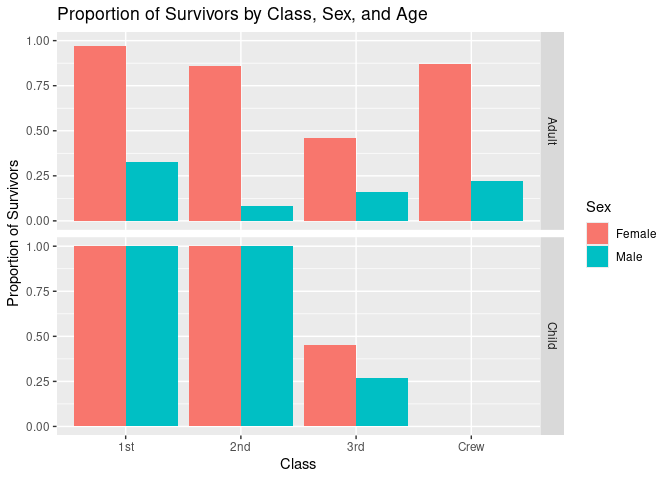

RMS Titanic
================
(Your name here)
2020-

- [Grading Rubric](#grading-rubric)
  - [Individual](#individual)
  - [Submission](#submission)
- [First Look](#first-look)
  - [**q1** Perform a glimpse of `df_titanic`. What variables are in
    this
    dataset?](#q1-perform-a-glimpse-of-df_titanic-what-variables-are-in-this-dataset)
  - [**q2** Skim the Wikipedia article on the RMS Titanic, and look for
    a total count of souls aboard. Compare against the total computed
    below. Are there any differences? Are those differences large or
    small? What might account for those
    differences?](#q2-skim-the-wikipedia-article-on-the-rms-titanic-and-look-for-a-total-count-of-souls-aboard-compare-against-the-total-computed-below-are-there-any-differences-are-those-differences-large-or-small-what-might-account-for-those-differences)
  - [**q3** Create a plot showing the count of persons who *did*
    survive, along with aesthetics for `Class` and `Sex`. Document your
    observations
    below.](#q3-create-a-plot-showing-the-count-of-persons-who-did-survive-along-with-aesthetics-for-class-and-sex-document-your-observations-below)
- [Deeper Look](#deeper-look)
  - [**q4** Replicate your visual from q3, but display `Prop` in place
    of `n`. Document your observations, and note any new/different
    observations you make in comparison with q3. Is there anything
    *fishy* in your
    plot?](#q4-replicate-your-visual-from-q3-but-display-prop-in-place-of-n-document-your-observations-and-note-any-newdifferent-observations-you-make-in-comparison-with-q3-is-there-anything-fishy-in-your-plot)
  - [**q5** Create a plot showing the group-proportion of occupants who
    *did* survive, along with aesthetics for `Class`, `Sex`, *and*
    `Age`. Document your observations
    below.](#q5-create-a-plot-showing-the-group-proportion-of-occupants-who-did-survive-along-with-aesthetics-for-class-sex-and-age-document-your-observations-below)
- [Notes](#notes)

*Purpose*: Most datasets have at least a few variables. Part of our task
in analyzing a dataset is to understand trends as they vary across these
different variables. Unless we’re careful and thorough, we can easily
miss these patterns. In this challenge you’ll analyze a dataset with a
small number of categorical variables and try to find differences among
the groups.

*Reading*: (Optional) [Wikipedia
article](https://en.wikipedia.org/wiki/RMS_Titanic) on the RMS Titanic.

<!-- include-rubric -->

# Grading Rubric

<!-- -------------------------------------------------- -->

Unlike exercises, **challenges will be graded**. The following rubrics
define how you will be graded, both on an individual and team basis.

## Individual

<!-- ------------------------- -->

| Category | Needs Improvement | Satisfactory |
|----|----|----|
| Effort | Some task **q**’s left unattempted | All task **q**’s attempted |
| Observed | Did not document observations, or observations incorrect | Documented correct observations based on analysis |
| Supported | Some observations not clearly supported by analysis | All observations clearly supported by analysis (table, graph, etc.) |
| Assessed | Observations include claims not supported by the data, or reflect a level of certainty not warranted by the data | Observations are appropriately qualified by the quality & relevance of the data and (in)conclusiveness of the support |
| Specified | Uses the phrase “more data are necessary” without clarification | Any statement that “more data are necessary” specifies which *specific* data are needed to answer what *specific* question |
| Code Styled | Violations of the [style guide](https://style.tidyverse.org/) hinder readability | Code sufficiently close to the [style guide](https://style.tidyverse.org/) |

## Submission

<!-- ------------------------- -->

Make sure to commit both the challenge report (`report.md` file) and
supporting files (`report_files/` folder) when you are done! Then submit
a link to Canvas. **Your Challenge submission is not complete without
all files uploaded to GitHub.**

``` r
library(tidyverse)
```

    ## ── Attaching core tidyverse packages ──────────────────────── tidyverse 2.0.0 ──
    ## ✔ dplyr     1.1.4     ✔ readr     2.1.5
    ## ✔ forcats   1.0.0     ✔ stringr   1.5.1
    ## ✔ ggplot2   3.5.1     ✔ tibble    3.2.1
    ## ✔ lubridate 1.9.4     ✔ tidyr     1.3.1
    ## ✔ purrr     1.0.2     
    ## ── Conflicts ────────────────────────────────────────── tidyverse_conflicts() ──
    ## ✖ dplyr::filter() masks stats::filter()
    ## ✖ dplyr::lag()    masks stats::lag()
    ## ℹ Use the conflicted package (<http://conflicted.r-lib.org/>) to force all conflicts to become errors

``` r
df_titanic <- as_tibble(Titanic)
```

*Background*: The RMS Titanic sank on its maiden voyage in 1912; about
67% of its passengers died.

# First Look

<!-- -------------------------------------------------- -->

### **q1** Perform a glimpse of `df_titanic`. What variables are in this dataset?

``` r
## TASK: Perform a `glimpse` of df_titanic
glimpse(df_titanic)
```

    ## Rows: 32
    ## Columns: 5
    ## $ Class    <chr> "1st", "2nd", "3rd", "Crew", "1st", "2nd", "3rd", "Crew", "1s…
    ## $ Sex      <chr> "Male", "Male", "Male", "Male", "Female", "Female", "Female",…
    ## $ Age      <chr> "Child", "Child", "Child", "Child", "Child", "Child", "Child"…
    ## $ Survived <chr> "No", "No", "No", "No", "No", "No", "No", "No", "No", "No", "…
    ## $ n        <dbl> 0, 0, 35, 0, 0, 0, 17, 0, 118, 154, 387, 670, 4, 13, 89, 3, 5…

**Observations**: The variables include: Class, Sex, Age, Survived(or
not), and n.

### **q2** Skim the [Wikipedia article](https://en.wikipedia.org/wiki/RMS_Titanic) on the RMS Titanic, and look for a total count of souls aboard. Compare against the total computed below. Are there any differences? Are those differences large or small? What might account for those differences?

``` r
## NOTE: No need to edit! We'll cover how to
## do this calculation in a later exercise.
df_titanic %>% summarize(total = sum(n))
```

    ## # A tibble: 1 × 1
    ##   total
    ##   <dbl>
    ## 1  2201

**Observations**:

- Write your observations here
- Are there any differences?
  - Wikipedia estimated 2224 people were on the titanic while the data
    set showed 2201. I googled and there were minor variances(+-20)
    between the exact number of total crew and passengers on board.
- If yes, what might account for those differences? -I think these
  differences probably happened because back then, before wifi and
  online technology, it was really hard to keep track of so many
  people’s names at once. Since everything was handwritten on paper, and
  the boarding process was probably really chaotic, it was probably
  unclear who actually made it on board versus who canceled their trip
  at the last minute.

### **q3** Create a plot showing the count of persons who *did* survive, along with aesthetics for `Class` and `Sex`. Document your observations below.

*Note*: There are many ways to do this.

``` r
## TASK: Visualize counts against `Class` and `Sex`
df_titanic %>% 
  filter(Survived == "Yes") %>% 
  select(Class, Sex, Survived, n) %>% 
  ggplot(aes(x = Class, y = n, fill = Sex)) +
  geom_col(position = "dodge") +  
  labs(title = "Number of People Who Survived by Class and Sex",
       x = "Class",
       y = "Count",
       fill = "Sex") 
```

<!-- -->

**Observations**:

- In the case of first and second class, there are significantly more
  females who survived than males. In third class, the number of male
  and female survivors was about the same. For the crew, there were a
  lot more male crew members who survived than female ones - I suspect
  that’s because way more men worked on ships back then than females.
  What really surprises me is that more male crew members survived than
  first-class females. This goes against what I assumed about crew
  members having to help passengers and getting on the lifeboats last. I
  wonder if looking at these numbers gives us clues about the order
  people actually got onto the lifeboats.

# Deeper Look

<!-- -------------------------------------------------- -->

Raw counts give us a sense of totals, but they are not as useful for
understanding differences between groups. This is because the
differences we see in counts could be due to either the relative size of
the group OR differences in outcomes for those groups. To make
comparisons between groups, we should also consider *proportions*.\[1\]

The following code computes proportions within each `Class, Sex, Age`
group.

``` r
## NOTE: No need to edit! We'll cover how to
## do this calculation in a later exercise.
df_prop <-
  df_titanic %>%
  group_by(Class, Sex, Age) %>%
  mutate(
    Total = sum(n),
    Prop = n / Total
  ) %>%
  ungroup()
df_prop
```

    ## # A tibble: 32 × 7
    ##    Class Sex    Age   Survived     n Total    Prop
    ##    <chr> <chr>  <chr> <chr>    <dbl> <dbl>   <dbl>
    ##  1 1st   Male   Child No           0     5   0    
    ##  2 2nd   Male   Child No           0    11   0    
    ##  3 3rd   Male   Child No          35    48   0.729
    ##  4 Crew  Male   Child No           0     0 NaN    
    ##  5 1st   Female Child No           0     1   0    
    ##  6 2nd   Female Child No           0    13   0    
    ##  7 3rd   Female Child No          17    31   0.548
    ##  8 Crew  Female Child No           0     0 NaN    
    ##  9 1st   Male   Adult No         118   175   0.674
    ## 10 2nd   Male   Adult No         154   168   0.917
    ## # ℹ 22 more rows

### **q4** Replicate your visual from q3, but display `Prop` in place of `n`. Document your observations, and note any new/different observations you make in comparison with q3. Is there anything *fishy* in your plot?

``` r
df_prop %>% 
  filter(Survived == "Yes") %>% 
  select(Class, Sex, Survived, Prop) %>% 
  na.omit() %>% 
  ggplot(aes(x = Class, y = Prop, fill = Sex)) +
  geom_col(position = "dodge") +  
  labs(title = "Number of People Who Survived by Class and Sex",
       x = "Class",
       y = "proportions",
       fill = "Sex") 
```

<!-- -->

**Observations**:

- Write your observations here. 1st class and 2nd class both gender’s
  “proportion” is 1. Which is 100% survival rate. That indicates to me
  there are probably something going on with the way I am using df_prop
  is wrong. If proportion is representing the survival rate across that
  certain group of people, then it indicates to me that my hypothesis of
  there were a lot more male ship workers than there are female is
  correct. Because although the actual number of male crews who survived
  significantly outnumbered the female, the female crew still have a way
  higher survival rate than the male crew. There are also more males
  than female passengers in the 3rd class category.
- Is there anything *fishy* going on in your plot?
  - Yes, both genders on 1st and 2nd class have a 100% of survival rate.
    That is wrong:(

### **q5** Create a plot showing the group-proportion of occupants who *did* survive, along with aesthetics for `Class`, `Sex`, *and* `Age`. Document your observations below.

*Hint*: Don’t forget that you can use `facet_grid` to help consider
additional variables!

``` r
df_prop %>%
  filter(Survived == "Yes") %>%  
  na.omit() %>% 
  ggplot(aes(x = Class, y = Prop, fill = Sex)) +
  geom_col(position = "dodge") +  
  labs(title = "Proportion of Survivors by Class, Sex, and Age",
       x = "Class",
       y = "Proportion of Survivors",
       fill = "Sex") +
  facet_grid(Age ~ .)  
```

<!-- -->

**Observations**: -Looking at survival rates by gender, females had much
higher survival rates than males within each class. I notice there’s a
clear pattern where female survival rates got lower as you went down in
class. But for males, the survival rates stayed pretty low across all
classes without much difference between them. First and second class
children had 100% survival rates, then there’s this big drop when you
look at third class children’s survival rates. I wonder if maybe they
ran out of time in the end. I realized something about my earlier
observation of male crew survivors. While I saw lots of male crew
members survive in terms of raw numbers, when you look at it as a
survival rate, they’re actually right in line with the other male
groups. This probably means male crew members were just the biggest
group overall in the dataset. - If you saw something *fishy* in q4
above, use your new plot to explain the fishy-ness. - The survival rate
of children in 1st and 2nd class is 100%, which skews the data in last
problem because we omitted the age column.

# Notes

<!-- -------------------------------------------------- -->

\[1\] This is basically the same idea as [Dimensional
Analysis](https://en.wikipedia.org/wiki/Dimensional_analysis); computing
proportions is akin to non-dimensionalizing a quantity.
