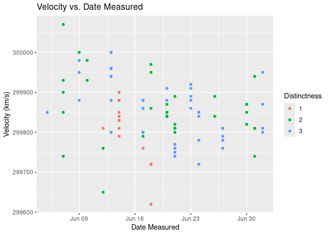

Michelson Speed-of-light Measurements
================
(Your name here)
2020-

- [Grading Rubric](#grading-rubric)
  - [Individual](#individual)
  - [Submission](#submission)
    - [**q1** Re-create the following table (from Michelson (1880),
      pg. 139) using `df_michelson` and `dplyr`. Note that your values
      *will not* match those of Michelson *exactly*; why might this
      be?](#q1-re-create-the-following-table-from-michelson-1880-pg-139-using-df_michelson-and-dplyr-note-that-your-values-will-not-match-those-of-michelson-exactly-why-might-this-be)
    - [**q2** Create a new variable `VelocityVacuum` with the $+92$ km/s
      adjustment to `Velocity`. Assign this new dataframe to
      `df_q2`.](#q2-create-a-new-variable-velocityvacuum-with-the-92-kms-adjustment-to-velocity-assign-this-new-dataframe-to-df_q2)
    - [**q3** Compare Michelson’s speed of light estimate against the
      modern speed of light value. Is Michelson’s estimate of the error
      (his uncertainty) greater or less than the true
      error?](#q3-compare-michelsons-speed-of-light-estimate-against-the-modern-speed-of-light-value-is-michelsons-estimate-of-the-error-his-uncertainty-greater-or-less-than-the-true-error)
    - [**q4** Inspect the following plot with the `Real` Michelson data
      and `Simulated` data from a probability model. Document the
      similarities and differences between the data under *observe*
      below.](#q4-inspect-the-following-plot-with-the-real-michelson-data-and-simulated-data-from-a-probability-model-document-the-similarities-and-differences-between-the-data-under-observe-below)
  - [Bibliography](#bibliography)

*Purpose*: When studying physical problems, there is an important
distinction between *error* and *uncertainty*. The primary purpose of
this challenge is to dip our toes into these factors by analyzing a real
dataset.

*Reading*: [Experimental Determination of the Velocity of
Light](https://play.google.com/books/reader?id=343nAAAAMAAJ&hl=en&pg=GBS.PA115)
(Optional)

<!-- include-rubric -->

# Grading Rubric

<!-- -------------------------------------------------- -->

Unlike exercises, **challenges will be graded**. The following rubrics
define how you will be graded, both on an individual and team basis.

## Individual

<!-- ------------------------- -->

| Category | Needs Improvement | Satisfactory |
|----|----|----|
| Effort | Some task **q**’s left unattempted | All task **q**’s attempted |
| Observed | Did not document observations, or observations incorrect | Documented correct observations based on analysis |
| Supported | Some observations not clearly supported by analysis | All observations clearly supported by analysis (table, graph, etc.) |
| Assessed | Observations include claims not supported by the data, or reflect a level of certainty not warranted by the data | Observations are appropriately qualified by the quality & relevance of the data and (in)conclusiveness of the support |
| Specified | Uses the phrase “more data are necessary” without clarification | Any statement that “more data are necessary” specifies which *specific* data are needed to answer what *specific* question |
| Code Styled | Violations of the [style guide](https://style.tidyverse.org/) hinder readability | Code sufficiently close to the [style guide](https://style.tidyverse.org/) |

## Submission

<!-- ------------------------- -->

Make sure to commit both the challenge report (`report.md` file) and
supporting files (`report_files/` folder) when you are done! Then submit
a link to Canvas. **Your Challenge submission is not complete without
all files uploaded to GitHub.**

``` r
# Libraries
library(tidyverse)
library(googlesheets4)

url <- "https://docs.google.com/spreadsheets/d/1av_SXn4j0-4Rk0mQFik3LLr-uf0YdA06i3ugE6n-Zdo/edit?usp=sharing"

# Parameters
LIGHTSPEED_VACUUM    <- 299792.458 # Exact speed of light in a vacuum (km / s)
LIGHTSPEED_MICHELSON <- 299944.00  # Michelson's speed estimate (km / s)
LIGHTSPEED_PM        <- 51         # Michelson error estimate (km / s)
```

*Background*: In 1879 Albert Michelson led an experimental campaign to
measure the speed of light. His approach was a development upon the
method of Foucault\[3\], and resulted in a new estimate of
$v_0 = 299944 \pm 51$ kilometers per second (in a vacuum). This is very
close to the modern *exact* value of 2.9979246^{5}. In this challenge,
you will analyze Michelson’s original data, and explore some of the
factors associated with his experiment.

I’ve already copied Michelson’s data from his 1880 publication; the code
chunk below will load these data from a public googlesheet.

*Aside*: The speed of light is *exact* (there is **zero error** in the
value `LIGHTSPEED_VACUUM`) because the meter is actually
[*defined*](https://en.wikipedia.org/wiki/Metre#Speed_of_light_definition)
in terms of the speed of light!

``` r
## Note: No need to edit this chunk!
gs4_deauth()
ss <- gs4_get(url)
df_michelson <-
  read_sheet(ss) %>%
  select(Date, Distinctness, Temp, Velocity) %>%
  mutate(Distinctness = as_factor(Distinctness))
```

    ## ✔ Reading from "michelson1879".

    ## ✔ Range 'Sheet1'.

``` r
df_michelson %>% glimpse()
```

    ## Rows: 100
    ## Columns: 4
    ## $ Date         <dttm> 1879-06-05, 1879-06-07, 1879-06-07, 1879-06-07, 1879-06-…
    ## $ Distinctness <fct> 3, 2, 2, 2, 2, 2, 3, 3, 3, 3, 2, 2, 2, 2, 2, 1, 3, 3, 2, …
    ## $ Temp         <dbl> 76, 72, 72, 72, 72, 72, 83, 83, 83, 83, 83, 90, 90, 71, 7…
    ## $ Velocity     <dbl> 299850, 299740, 299900, 300070, 299930, 299850, 299950, 2…

*Data dictionary*:

- `Date`: Date of measurement
- `Distinctness`: Distinctness of measured images: 3 = good, 2 = fair, 1
  = poor
- `Temp`: Ambient temperature (Fahrenheit)
- `Velocity`: Measured speed of light (km / s)

### **q1** Re-create the following table (from Michelson (1880), pg. 139) using `df_michelson` and `dplyr`. Note that your values *will not* match those of Michelson *exactly*; why might this be?

| Distinctness | n   | MeanVelocity |
|--------------|-----|--------------|
| 3            | 46  | 299860       |
| 2            | 39  | 299860       |
| 1            | 15  | 299810       |

``` r
## TODO: Compute summaries
df_q1 <- df_michelson %>% 
  select(Distinctness, Velocity) %>% 
  group_by(Distinctness) %>% 
  summarize(
    n = n(),
    MeanVelocity = mean(Velocity)
    ) %>% 
  arrange(desc(Distinctness))

df_q1
```

    ## # A tibble: 3 × 3
    ##   Distinctness     n MeanVelocity
    ##   <fct>        <int>        <dbl>
    ## 1 3               46      299862.
    ## 2 2               39      299858.
    ## 3 1               15      299808

``` r
df_q1 %>%
  arrange(desc(Distinctness)) %>%
  knitr::kable()
```

| Distinctness |   n | MeanVelocity |
|:-------------|----:|-------------:|
| 3            |  46 |     299861.7 |
| 2            |  39 |     299858.5 |
| 1            |  15 |     299808.0 |

**Observations**: - Write your observations here! - Distinctness has a
positive relationship with the mean velocity. The differnece of mean
velocity between distincness 3 and 2 is negligible while betwwen 2 and 1
is a lot bigger. There are also less datapoints for Distinctness 1, so a
datapoint might alter the mean more than when there are lots of data. -
Why might your table differ from Michelson’s? - I noticed that all his
data are integers that are in the 10 accuracy, this made me wonder if
they rounded their data to the nearest 10.

The `Velocity` values in the dataset are the speed of light *in air*;
Michelson introduced a couple of adjustments to estimate the speed of
light in a vacuum. In total, he added $+92$ km/s to his mean estimate
for `VelocityVacuum` (from Michelson (1880), pg. 141). While the
following isn’t fully rigorous ($+92$ km/s is based on the mean
temperature), we’ll simply apply this correction to all the observations
in the dataset.

### **q2** Create a new variable `VelocityVacuum` with the $+92$ km/s adjustment to `Velocity`. Assign this new dataframe to `df_q2`.

``` r
## TODO: Adjust the data, assign to df_q2
df_q2 <- df_michelson %>% 
  mutate(
    VelocityVacuum = Velocity + 92
  )

summary(df_q2)
```

    ##       Date                     Distinctness      Temp          Velocity     
    ##  Min.   :1879-06-05 00:00:00   1:15         Min.   :58.00   Min.   :299620  
    ##  1st Qu.:1879-06-13 00:00:00   2:39         1st Qu.:72.00   1st Qu.:299808  
    ##  Median :1879-06-19 00:00:00   3:46         Median :77.00   Median :299850  
    ##  Mean   :1879-06-18 20:38:24                Mean   :76.39   Mean   :299852  
    ##  3rd Qu.:1879-06-23 06:00:00                3rd Qu.:83.25   3rd Qu.:299892  
    ##  Max.   :1879-07-02 00:00:00                Max.   :90.00   Max.   :300070  
    ##  VelocityVacuum  
    ##  Min.   :299712  
    ##  1st Qu.:299900  
    ##  Median :299942  
    ##  Mean   :299944  
    ##  3rd Qu.:299984  
    ##  Max.   :300162

As part of his study, Michelson assessed the various potential sources
of error, and provided his best-guess for the error in his
speed-of-light estimate. These values are provided in
`LIGHTSPEED_MICHELSON`—his nominal estimate—and
`LIGHTSPEED_PM`—plus/minus bounds on his estimate. Put differently,
Michelson believed the true value of the speed-of-light probably lay
between `LIGHTSPEED_MICHELSON - LIGHTSPEED_PM` and
`LIGHTSPEED_MICHELSON + LIGHTSPEED_PM`.

Let’s introduce some terminology:\[2\]

- **Error** is the difference between a true value and an estimate of
  that value; for instance `LIGHTSPEED_VACUUM - LIGHTSPEED_MICHELSON`.
- **Uncertainty** is an analyst’s *assessment* of the error.

Since a “true” value is often not known in practice, one generally does
not know the error. The best they can do is quantify their degree of
uncertainty. We will learn some means of quantifying uncertainty in this
class, but for many real problems uncertainty includes some amount of
human judgment.\[2\]

### **q3** Compare Michelson’s speed of light estimate against the modern speed of light value. Is Michelson’s estimate of the error (his uncertainty) greater or less than the true error?

``` r
## TODO: Compare Michelson's estimate and error against the true value
## Your code here!
modern_speed <- LIGHTSPEED_VACUUM
true_error <- (modern_speed - LIGHTSPEED_MICHELSON)
lower_bound <- (LIGHTSPEED_MICHELSON - LIGHTSPEED_PM)
upper_bound <- (LIGHTSPEED_MICHELSON + LIGHTSPEED_PM)
estimate_of_error <- LIGHTSPEED_PM*2
cat("Michelson's estimate of error:", LIGHTSPEED_PM, "km/s\n")
```

    ## Michelson's estimate of error: 51 km/s

``` r
cat("Modern speed of light:", modern_speed, "km/s\n")
```

    ## Modern speed of light: 299792.5 km/s

``` r
cat("Michelson's estimate:", LIGHTSPEED_MICHELSON, "km/s\n")
```

    ## Michelson's estimate: 299944 km/s

``` r
cat("Michelson's estimate of error: ", estimate_of_error, "km/s\n")
```

    ## Michelson's estimate of error:  102 km/s

``` r
cat("True error:", true_error, "km/s\n")
```

    ## True error: -151.542 km/s

``` r
cat("Lower bound:", lower_bound, "km/s\n")
```

    ## Lower bound: 299893 km/s

``` r
cat("Upper bound:", upper_bound, "km/s\n")
```

    ## Upper bound: 299995 km/s

**Observations**: - Is Michelson’s estimate of the error (his
uncertainty) greater or less than the true error? - His estimate of
error is less than the true error because his range of uncertainty is
less than the true error.

- Make a quantitative comparison between Michelson’s uncertainty and his
  error. - He’s uncertainty is +- 51km/s which is a range of 102 km/s
  However, the true error between his estimate and the modern light
  speed is about 151.5km/s difference. So that is about a 50km/s gap
  between his uncertainty and the true error. However, given the
  magnitude of the speed of light, his estimated speed is within 0.05%
  in relation to the modern light speed (which is very impressively
  accurate in my opinion).

The following plot shows all of Michelson’s data as a [control
chart](https://en.wikipedia.org/wiki/Control_chart); this sort of plot
is common in manufacturing, where it is used to help determine if a
manufacturing process is under [statistical
control](https://en.wikipedia.org/wiki/Statistical_process_control).
Each dot is one of Michelson’s measurements, and the grey line connects
the mean taken for each day. The same plot also shows simulated data
using a probability model. We’ll get into statistics later in the
course; for now, let’s focus on understanding what real and simulated
data tend to look like.

### **q4** Inspect the following plot with the `Real` Michelson data and `Simulated` data from a probability model. Document the similarities and differences between the data under *observe* below.

``` r
## Note: No need to edit this chunk!
## Calibrate simulated data
v_mean <-
  df_q2 %>%
  summarize(m = mean(VelocityVacuum)) %>%
  pull(m)
v_sd <-
  df_q2 %>%
  summarize(s = sd(VelocityVacuum)) %>%
  pull(s)

## Visualize
set.seed(101)
df_q2 %>%
  mutate(Simulated = rnorm(n(), mean = v_mean, sd = v_sd)) %>%
  rename(Real = VelocityVacuum) %>%
  pivot_longer(
    cols = c(Simulated, Real),
    names_to = "source",
    values_to = "velocity"
  ) %>%

  ggplot(aes(Date, velocity)) +
  geom_hline(
    yintercept = LIGHTSPEED_MICHELSON,
    linetype = "dotted"
  ) +
  geom_hline(
    yintercept = LIGHTSPEED_MICHELSON - LIGHTSPEED_PM,
    linetype = "dashed"
  ) +
  geom_hline(
    yintercept = LIGHTSPEED_MICHELSON + LIGHTSPEED_PM,
    linetype = "dashed"
  ) +

  geom_line(
    data = . %>%
      group_by(Date, source) %>%
      summarize(velocity_mean = mean(velocity)),
    mapping = aes(y = velocity_mean),
    color = "grey50"
  ) +
  geom_point(
    mapping = aes(y = velocity),
    size = 0.8
  ) +

  facet_grid(source~.) +
  theme_minimal() +
  labs(
    x = "Date of Measurement (1879)",
    y = "Velocity (in Vacuum)"
  )
```

    ## `summarise()` has grouped output by 'Date'. You can override using the
    ## `.groups` argument.

<!-- -->

**Observations**: Similarities - As you can see from the graph, both
dataset’s measurement of lightspeed are mostly within the 299900 to
300000 km/s range, the spread of velocities are similar. Differences - I
would say that the real data seems to have more visible fluctuations,
possibly due to external conditions fluctuations of experimental
measurement error at that date.The simulated data appears more evenly
spread, as it is purely generated from a normal distribution. The real
data also appears to have slightly more extreme outliers than the
simulated data. \### **q5** You have access to a few other variables.
Construct a **at least three** visualizations of `VelocityVacuum`
against these other factors. Are there other patterns in the data that
might help explain the difference between Michelson’s estimate and
`LIGHTSPEED_VACUUM`?

``` r
line_labels <- data.frame(
  label = c("Michelson's Estimate (Vacuum)", "Speed of Light (Vacuum)", "Michelson's Measured"),
  y = c(LIGHTSPEED_MICHELSON, LIGHTSPEED_VACUUM, LIGHTSPEED_MICHELSON - 92)
)

plot1 <- df_michelson %>% 
  ggplot(aes(x = Distinctness, y = Velocity)) +  
  geom_boxplot() +
  geom_hline(data = line_labels, aes(yintercept = y, color = label), linetype = "dashed") +
  scale_color_manual(name = "Reference Speeds", 
                     values = c("Michelson's Estimate (Vacuum)" = "blue", 
                                "Speed of Light (Vacuum)" = "red", 
                                "Michelson's Measured" = "green")) +
  labs(title = "Velocity vs. Distinctness",
       y = "Velocity (km/s)",
       x = "Distinctness") 

plot1
```

<!-- -->
Observations: It is interesting to see that distinctness appears to have
a slight positive relationship with velocity. Which is interesting
because instinctively I would assume that the higher quality the light
image is the more accurate the data would be but actually the
measurement that is closest to the real light speed is the data with
lower distinctness. The spread of distinctness 1 is also the lowest,
although maybe that is just due to it having less data points as well.

``` r
plot2 <- df_michelson %>% 
  ggplot(aes(x = Date, y = Velocity, color = Distinctness)) +
  geom_point() +  
  labs(title = "Velocity vs. Date Measured",
       x = "Date Measured",
       y = "Velocity (km/s)",
       color = "Distinctness")
plot2
```

<!-- -->
observations: It’s interesting to see the relationship between the
distinctness and the date of measurement because it seems like the
majority of the data would have the same or largely the same
distinctness which suggest to me that distinctness is influenced by some
conditions that is specific to that date and location.

``` r
plot3 <- df_michelson %>% 
  ggplot(aes(x = Velocity)) +
  geom_histogram(binwidth = 50)+
  labs(title = "Distribution of Measured Velocities",
       x = "Velocity (km/s)",
       y = "Count")
plot3
```

<!-- -->
observations: Michelson’s measurements had random variation but were
systematically higher than today’s value. This tells me that maybe there
is some systematic error that applies to all his measurement(equiptment
or measurment of distance between the two mountains).

``` r
plot4 <-
  df_michelson %>% 
  ggplot(aes(x = as.factor(Distinctness), y = Temp)) +
  geom_boxplot() +
  labs(title = "Temperature vs. Distinctness",
       x = "Distinctness",
       y = "Temperature (°F)")
plot4
```

<!-- -->
Observations: First thing I noticed is that it appears that distinctness
has a positive relationship with temperature. As distinctness increases,
the median temperature also increases. This suggests that higher
temperatures are associated with clearer or more distinct observations.
And that it seems like there is less spread in distinctness 3 in
temperature than in 2 than in 1. This makes me wonder if this is due to
the fact that hot air is less dense than cold air so there are less air
particle interfering with the light’s path.

``` r
plot5<-
  df_michelson %>% 
  ggplot(aes(x = Temp, y = Velocity)) +
  geom_point() +  
  geom_smooth(method = "loess", color = "red", size = 1.2, se = TRUE) +  
  labs(title = "Velocity vs. Temperature (Trend)",
       x = "Temperature (°f)",
       y = "Velocity (km/s)") 
```

    ## Warning: Using `size` aesthetic for lines was deprecated in ggplot2 3.4.0.
    ## ℹ Please use `linewidth` instead.
    ## This warning is displayed once every 8 hours.
    ## Call `lifecycle::last_lifecycle_warnings()` to see where this warning was
    ## generated.

``` r
plot5
```

    ## `geom_smooth()` using formula = 'y ~ x'

<!-- -->
**Observations**:

- From the graph we can see that the velocity trends higher as the
  temperature gets higher although velocity is generally fairly
  scattered. This is consistent with my hypothesis of cold air having
  more air particles which can cause light to appear to slow down and
  hot air less dense leading to less particle and interference. There is
  also a very stable zone where the trend kind of plateaus off between
  65 to 85 degrees ish. This makes me wonder if this is limited by too
  little data points and too little temperature spread to confirm my
  hypothesis.

## Bibliography

- \[1\] Michelson, [Experimental Determination of the Velocity of
  Light](https://play.google.com/books/reader?id=343nAAAAMAAJ&hl=en&pg=GBS.PA115)
  1880) 
- \[2\] Henrion and Fischhoff, [Assessing Uncertainty in Physical
  Constants](https://www.cmu.edu/epp/people/faculty/research/Fischoff-Henrion-Assessing%20uncertainty%20in%20physical%20constants.pdf)
  1986) 
- \[3\] BYU video about a [Fizeau-Foucault
  apparatus](https://www.youtube.com/watch?v=Ik5ORaaeaME), similar to
  what Michelson used.
