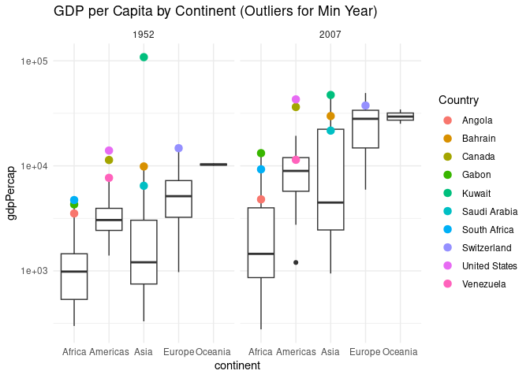

Gapminder
================
(Your name here)
2020-

- [Grading Rubric](#grading-rubric)
  - [Individual](#individual)
  - [Submission](#submission)
- [Guided EDA](#guided-eda)
  - [**q0** Perform your “first checks” on the dataset. What variables
    are in
    this](#q0-perform-your-first-checks-on-the-dataset-what-variables-are-in-this)
  - [**q1** Determine the most and least recent years in the `gapminder`
    dataset.](#q1-determine-the-most-and-least-recent-years-in-the-gapminder-dataset)
  - [**q2** Filter on years matching `year_min`, and make a plot of the
    GDP per capita against continent. Choose an appropriate `geom_` to
    visualize the data. What observations can you
    make?](#q2-filter-on-years-matching-year_min-and-make-a-plot-of-the-gdp-per-capita-against-continent-choose-an-appropriate-geom_-to-visualize-the-data-what-observations-can-you-make)
  - [**q3** You should have found *at least* three outliers in q2 (but
    possibly many more!). Identify those outliers (figure out which
    countries they
    are).](#q3-you-should-have-found-at-least-three-outliers-in-q2-but-possibly-many-more-identify-those-outliers-figure-out-which-countries-they-are)
  - [**q4** Create a plot similar to yours from q2 studying both
    `year_min` and `year_max`. Find a way to highlight the outliers from
    q3 on your plot *in a way that lets you identify which country is
    which*. Compare the patterns between `year_min` and
    `year_max`.](#q4-create-a-plot-similar-to-yours-from-q2-studying-both-year_min-and-year_max-find-a-way-to-highlight-the-outliers-from-q3-on-your-plot-in-a-way-that-lets-you-identify-which-country-is-which-compare-the-patterns-between-year_min-and-year_max)
- [Your Own EDA](#your-own-eda)
  - [**q5** Create *at least* three new figures below. With each figure,
    try to pose new questions about the
    data.](#q5-create-at-least-three-new-figures-below-with-each-figure-try-to-pose-new-questions-about-the-data)

*Purpose*: Learning to do EDA well takes practice! In this challenge
you’ll further practice EDA by first completing a guided exploration,
then by conducting your own investigation. This challenge will also give
you a chance to use the wide variety of visual tools we’ve been
learning.

<!-- include-rubric -->

# Grading Rubric

<!-- -------------------------------------------------- -->

Unlike exercises, **challenges will be graded**. The following rubrics
define how you will be graded, both on an individual and team basis.

## Individual

<!-- ------------------------- -->

| Category | Needs Improvement | Satisfactory |
|----|----|----|
| Effort | Some task **q**’s left unattempted | All task **q**’s attempted |
| Observed | Did not document observations, or observations incorrect | Documented correct observations based on analysis |
| Supported | Some observations not clearly supported by analysis | All observations clearly supported by analysis (table, graph, etc.) |
| Assessed | Observations include claims not supported by the data, or reflect a level of certainty not warranted by the data | Observations are appropriately qualified by the quality & relevance of the data and (in)conclusiveness of the support |
| Specified | Uses the phrase “more data are necessary” without clarification | Any statement that “more data are necessary” specifies which *specific* data are needed to answer what *specific* question |
| Code Styled | Violations of the [style guide](https://style.tidyverse.org/) hinder readability | Code sufficiently close to the [style guide](https://style.tidyverse.org/) |

## Submission

<!-- ------------------------- -->

Make sure to commit both the challenge report (`report.md` file) and
supporting files (`report_files/` folder) when you are done! Then submit
a link to Canvas. **Your Challenge submission is not complete without
all files uploaded to GitHub.**

``` r
library(tidyverse)
```

    ## ── Attaching core tidyverse packages ──────────────────────── tidyverse 2.0.0 ──
    ## ✔ dplyr     1.1.4     ✔ readr     2.1.5
    ## ✔ forcats   1.0.0     ✔ stringr   1.5.1
    ## ✔ ggplot2   3.5.1     ✔ tibble    3.2.1
    ## ✔ lubridate 1.9.4     ✔ tidyr     1.3.1
    ## ✔ purrr     1.0.2     
    ## ── Conflicts ────────────────────────────────────────── tidyverse_conflicts() ──
    ## ✖ dplyr::filter() masks stats::filter()
    ## ✖ dplyr::lag()    masks stats::lag()
    ## ℹ Use the conflicted package (<http://conflicted.r-lib.org/>) to force all conflicts to become errors

``` r
library(gapminder)
```

*Background*: [Gapminder](https://www.gapminder.org/about-gapminder/) is
an independent organization that seeks to educate people about the state
of the world. They seek to counteract the worldview constructed by a
hype-driven media cycle, and promote a “fact-based worldview” by
focusing on data. The dataset we’ll study in this challenge is from
Gapminder.

# Guided EDA

<!-- -------------------------------------------------- -->

First, we’ll go through a round of *guided EDA*. Try to pay attention to
the high-level process we’re going through—after this guided round
you’ll be responsible for doing another cycle of EDA on your own!

### **q0** Perform your “first checks” on the dataset. What variables are in this

dataset?

``` r
## TASK: Do your "first checks" here!
glimpse(gapminder)
```

    ## Rows: 1,704
    ## Columns: 6
    ## $ country   <fct> "Afghanistan", "Afghanistan", "Afghanistan", "Afghanistan", …
    ## $ continent <fct> Asia, Asia, Asia, Asia, Asia, Asia, Asia, Asia, Asia, Asia, …
    ## $ year      <int> 1952, 1957, 1962, 1967, 1972, 1977, 1982, 1987, 1992, 1997, …
    ## $ lifeExp   <dbl> 28.801, 30.332, 31.997, 34.020, 36.088, 38.438, 39.854, 40.8…
    ## $ pop       <int> 8425333, 9240934, 10267083, 11537966, 13079460, 14880372, 12…
    ## $ gdpPercap <dbl> 779.4453, 820.8530, 853.1007, 836.1971, 739.9811, 786.1134, …

``` r
summary(gapminder)
```

    ##         country        continent        year         lifeExp     
    ##  Afghanistan:  12   Africa  :624   Min.   :1952   Min.   :23.60  
    ##  Albania    :  12   Americas:300   1st Qu.:1966   1st Qu.:48.20  
    ##  Algeria    :  12   Asia    :396   Median :1980   Median :60.71  
    ##  Angola     :  12   Europe  :360   Mean   :1980   Mean   :59.47  
    ##  Argentina  :  12   Oceania : 24   3rd Qu.:1993   3rd Qu.:70.85  
    ##  Australia  :  12                  Max.   :2007   Max.   :82.60  
    ##  (Other)    :1632                                                
    ##       pop              gdpPercap       
    ##  Min.   :6.001e+04   Min.   :   241.2  
    ##  1st Qu.:2.794e+06   1st Qu.:  1202.1  
    ##  Median :7.024e+06   Median :  3531.8  
    ##  Mean   :2.960e+07   Mean   :  7215.3  
    ##  3rd Qu.:1.959e+07   3rd Qu.:  9325.5  
    ##  Max.   :1.319e+09   Max.   :113523.1  
    ## 

**Observations**:

- Write all variable names here

### **q1** Determine the most and least recent years in the `gapminder` dataset.

*Hint*: Use the `pull()` function to get a vector out of a tibble.
(Rather than the `$` notation of base R.)

``` r
## TASK: Find the largest and smallest values of `year` in `gapminder`
year_max <- pull(gapminder, year) %>% max()
year_min <-  pull(gapminder, year) %>% min()
```

Use the following test to check your work.

``` r
## NOTE: No need to change this
assertthat::assert_that(year_max %% 7 == 5)
```

    ## [1] TRUE

``` r
assertthat::assert_that(year_max %% 3 == 0)
```

    ## [1] TRUE

``` r
assertthat::assert_that(year_min %% 7 == 6)
```

    ## [1] TRUE

``` r
assertthat::assert_that(year_min %% 3 == 2)
```

    ## [1] TRUE

``` r
if (is_tibble(year_max)) {
  print("year_max is a tibble; try using `pull()` to get a vector")
  assertthat::assert_that(False)
}

print("Nice!")
```

    ## [1] "Nice!"

### **q2** Filter on years matching `year_min`, and make a plot of the GDP per capita against continent. Choose an appropriate `geom_` to visualize the data. What observations can you make?

You may encounter difficulties in visualizing these data; if so document
your challenges and attempt to produce the most informative visual you
can.

``` r
## TASK: Create a visual of gdpPercap vs continent
min_year_df <-gapminder %>% 
  filter(year == year_min) 
highest_gdp_country <- min_year_df %>%
  slice_max(order_by = gdpPercap, n = 1) %>%  
  select(country, gdpPercap)
highest_gdp_country
```

    ## # A tibble: 1 × 2
    ##   country gdpPercap
    ##   <fct>       <dbl>
    ## 1 Kuwait    108382.

``` r
min_year_df%>% 
  filter(country != "Kuwait") %>% 
  ggplot(aes(x = continent, y = gdpPercap)) +
  geom_boxplot()
```

<!-- -->

``` r
  # geom_jitter(width = 0.2, alpha = 0.7)+
  #coord_cartesian(ylim = c(0, 15000))
```

**Observations**:

-First of all, because Oceania only has two data points, the box plot
doesn’t reveal much about its distribution. However, it does have the
highest median GDP per capita among all continents.Africa and Asia have
the lowest median GDP per capita, but there’s a key difference between
them—Asia’s box extends further upward, suggesting a wider range of GDP
values, while Africa’s box is narrower, with the median sitting near the
middle, indicating that most African countries have GDP per capita
values that are more tightly concentrated.Europe has both a long box and
long whiskers, meaning GDP per capita varies significantly across the
continent. The median sits right in the middle, suggesting a more evenly
distributed spread of values. The Americas show a similar pattern, but
with a narrower box and whiskers, meaning the GDP values are more
concentrated than in Europe. This could also suggest that there are
fewer countries in the Americas compared to Europe.There are a few
outliers in every continent (except Oceania), but what really stands out
is that even the highest outliers in Africa fall below Europe’s median
GDP per capita, emphasizing the economic disparity between continents.

**Difficulties & Approaches**:

- There is one country in asia that has a gdp per cap so high that it
  skews the y axis so much that all of the other data just gets
  squished. I wanted to find out which country that is so i used
  slice_max to find out that it was Kuwait. I then went back to my
  plotting and filtered out Kuwait.

### **q3** You should have found *at least* three outliers in q2 (but possibly many more!). Identify those outliers (figure out which countries they are).

``` r
## TASK: Identify the outliers from q2

ordered <-min_year_df %>% 
  filter(continent == "Asia") %>% # switch continents
  arrange(desc(gdpPercap))
ordered
```

    ## # A tibble: 33 × 6
    ##    country          continent  year lifeExp      pop gdpPercap
    ##    <fct>            <fct>     <int>   <dbl>    <int>     <dbl>
    ##  1 Kuwait           Asia       1952    55.6   160000   108382.
    ##  2 Bahrain          Asia       1952    50.9   120447     9867.
    ##  3 Saudi Arabia     Asia       1952    39.9  4005677     6460.
    ##  4 Lebanon          Asia       1952    55.9  1439529     4835.
    ##  5 Iraq             Asia       1952    45.3  5441766     4130.
    ##  6 Israel           Asia       1952    65.4  1620914     4087.
    ##  7 Japan            Asia       1952    63.0 86459025     3217.
    ##  8 Hong Kong, China Asia       1952    61.0  2125900     3054.
    ##  9 Iran             Asia       1952    44.9 17272000     3035.
    ## 10 Singapore        Asia       1952    60.4  1127000     2315.
    ## # ℹ 23 more rows

**Observations**:

- Identify the outlier countries from q2
  - Asia:Kuwait,Bahrain,Saudi Arabia
  - Europe: Switzerland
  - Americas: US, Canada, Venezuela
  - Africa: South Africa, Gabon, Angola

*Hint*: For the next task, it’s helpful to know a ggplot trick we’ll
learn in an upcoming exercise: You can use the `data` argument inside
any `geom_*` to modify the data that will be plotted *by that geom
only*. For instance, you can use this trick to filter a set of points to
label:

``` r
## NOTE: No need to edit, use ideas from this in q4 below
gapminder %>%
  filter(year == max(year)) %>%

  ggplot(aes(continent, lifeExp)) +
  geom_boxplot() +
  geom_point(
    data = . %>% filter(country %in% c("United Kingdom", "Japan", "Zambia")),
    mapping = aes(color = country),
    size = 2
  )
```

<!-- -->

### **q4** Create a plot similar to yours from q2 studying both `year_min` and `year_max`. Find a way to highlight the outliers from q3 on your plot *in a way that lets you identify which country is which*. Compare the patterns between `year_min` and `year_max`.

*Hint*: We’ve learned a lot of different ways to show multiple
variables; think about using different aesthetics or facets.

``` r
## TASK: Create a visual of gdpPercap vs continent

outliar_asia <- c("Kuwait", "Bahrain", "Saudi Arabia")
outliar_europe <- c("Switzerland")
outliar_america <- c("United States", "Canada", "Venezuela")
outliar_africa <- c("South Africa", "Gabon", "Angola")
outliars <- c(outliar_asia, outliar_europe, outliar_america, outliar_africa)

gapminder %>%
  filter(year %in% c(max(year), min(year))) %>%
  ggplot(aes(continent, gdpPercap)) +
  geom_boxplot() +
  geom_point(
    data = . %>%
      filter(country %in% outliars),
    aes(color = country),  
    size = 3
  ) +
  facet_wrap(~ year) + 
  coord_cartesian(ylim = c(0, 50000))
```

<!-- -->

``` r
  labs(title = "GDP per Capita by Continent (Outliers for Min Year)",
       color = "Country") +
  theme_minimal()
```

    ## NULL

**Observations**:

- To avoid the plot being skewed by Kuwait, I set a y-axis limit to
  remove it from the left plot. Most of the countries that were outliers
  are still in the higher GDP per capita range, but now only the US,
  Canada, South Africa, and Gabon remain as outliers. The others have
  either fallen within the whiskers or, in the case of countries like
  Saudi Arabia and Venezuela, have moved to the upper limit of the box.
  It’s also worth noting that the variance in Asia and Europe has
  increased significantly, with their boxes and whiskers becoming
  noticeably longer. The gap between the medians across continents has
  widened a lot more. This data exhibits heteroscedasticity.

# Your Own EDA

<!-- -------------------------------------------------- -->

Now it’s your turn! We just went through guided EDA considering the GDP
per capita at two time points. You can continue looking at outliers,
consider different years, repeat the exercise with `lifeExp`, consider
the relationship between variables, or something else entirely.

### **q5** Create *at least* three new figures below. With each figure, try to pose new questions about the data.

``` r
## TASK: Your first graph
```

- (Your notes and observations here)

``` r
## TASK: Your second graph
```

- (Your notes and observations here)

``` r
## TASK: Your third graph
```

- (Your notes and observations here)
