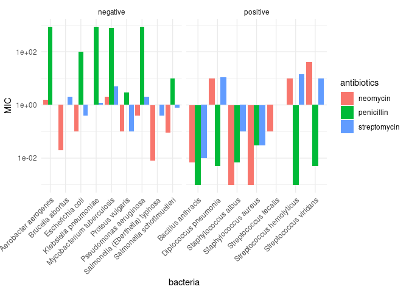
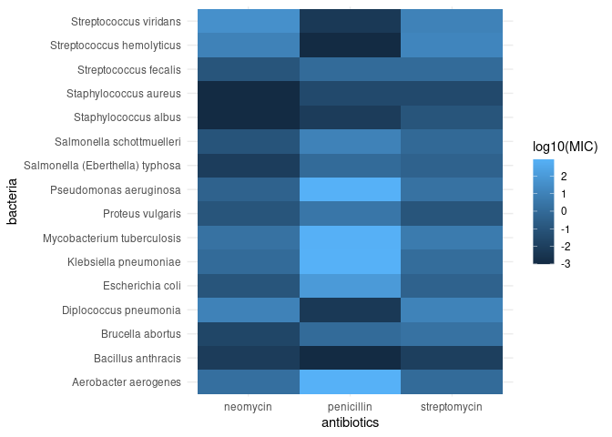

Antibiotics
================
ariel chen
2025/3/9

*Purpose*: Creating effective data visualizations is an *iterative*
process; very rarely will the first graph you make be the most
effective. The most effective thing you can do to be successful in this
iterative process is to *try multiple graphs* of the same data.

Furthermore, judging the effectiveness of a visual is completely
dependent on *the question you are trying to answer*. A visual that is
totally ineffective for one question may be perfect for answering a
different question.

In this challenge, you will practice *iterating* on data visualization,
and will anchor the *assessment* of your visuals using two different
questions.

*Note*: Please complete your initial visual design **alone**. Work on
both of your graphs alone, and save a version to your repo *before*
coming together with your team. This way you can all bring a diversity
of ideas to the table!

<!-- include-rubric -->

# Grading Rubric

<!-- -------------------------------------------------- -->

Unlike exercises, **challenges will be graded**. The following rubrics
define how you will be graded, both on an individual and team basis.

## Individual

<!-- ------------------------- -->

| Category | Needs Improvement | Satisfactory |
|----|----|----|
| Effort | Some task **q**’s left unattempted | All task **q**’s attempted |
| Observed | Did not document observations, or observations incorrect | Documented correct observations based on analysis |
| Supported | Some observations not clearly supported by analysis | All observations clearly supported by analysis (table, graph, etc.) |
| Assessed | Observations include claims not supported by the data, or reflect a level of certainty not warranted by the data | Observations are appropriately qualified by the quality & relevance of the data and (in)conclusiveness of the support |
| Specified | Uses the phrase “more data are necessary” without clarification | Any statement that “more data are necessary” specifies which *specific* data are needed to answer what *specific* question |
| Code Styled | Violations of the [style guide](https://style.tidyverse.org/) hinder readability | Code sufficiently close to the [style guide](https://style.tidyverse.org/) |

## Submission

<!-- ------------------------- -->

Make sure to commit both the challenge report (`report.md` file) and
supporting files (`report_files/` folder) when you are done! Then submit
a link to Canvas. **Your Challenge submission is not complete without
all files uploaded to GitHub.**

``` r
library(tidyverse)
```

    ## ── Attaching core tidyverse packages ──────────────────────── tidyverse 2.0.0 ──
    ## ✔ dplyr     1.1.4     ✔ readr     2.1.5
    ## ✔ forcats   1.0.0     ✔ stringr   1.5.1
    ## ✔ ggplot2   3.5.1     ✔ tibble    3.2.1
    ## ✔ lubridate 1.9.4     ✔ tidyr     1.3.1
    ## ✔ purrr     1.0.2     
    ## ── Conflicts ────────────────────────────────────────── tidyverse_conflicts() ──
    ## ✖ dplyr::filter() masks stats::filter()
    ## ✖ dplyr::lag()    masks stats::lag()
    ## ℹ Use the conflicted package (<http://conflicted.r-lib.org/>) to force all conflicts to become errors

``` r
library(ggrepel)
```

*Background*: The data\[1\] we study in this challenge report the
[*minimum inhibitory
concentration*](https://en.wikipedia.org/wiki/Minimum_inhibitory_concentration)
(MIC) of three drugs for different bacteria. The smaller the MIC for a
given drug and bacteria pair, the more practical the drug is for
treating that particular bacteria. An MIC value of *at most* 0.1 is
considered necessary for treating human patients.

These data report MIC values for three antibiotics—penicillin,
streptomycin, and neomycin—on 16 bacteria. Bacteria are categorized into
a genus based on a number of features, including their resistance to
antibiotics.

``` r
## NOTE: If you extracted all challenges to the same location,
## you shouldn't have to change this filename
filename <- "./data/antibiotics.csv"

## Load the data
df_antibiotics <- read_csv(filename)
```

    ## Rows: 16 Columns: 5
    ## ── Column specification ────────────────────────────────────────────────────────
    ## Delimiter: ","
    ## chr (2): bacteria, gram
    ## dbl (3): penicillin, streptomycin, neomycin
    ## 
    ## ℹ Use `spec()` to retrieve the full column specification for this data.
    ## ℹ Specify the column types or set `show_col_types = FALSE` to quiet this message.

``` r
df_antibiotics %>% knitr::kable()
```

| bacteria                        | penicillin | streptomycin | neomycin | gram     |
|:--------------------------------|-----------:|-------------:|---------:|:---------|
| Aerobacter aerogenes            |    870.000 |         1.00 |    1.600 | negative |
| Brucella abortus                |      1.000 |         2.00 |    0.020 | negative |
| Bacillus anthracis              |      0.001 |         0.01 |    0.007 | positive |
| Diplococcus pneumonia           |      0.005 |        11.00 |   10.000 | positive |
| Escherichia coli                |    100.000 |         0.40 |    0.100 | negative |
| Klebsiella pneumoniae           |    850.000 |         1.20 |    1.000 | negative |
| Mycobacterium tuberculosis      |    800.000 |         5.00 |    2.000 | negative |
| Proteus vulgaris                |      3.000 |         0.10 |    0.100 | negative |
| Pseudomonas aeruginosa          |    850.000 |         2.00 |    0.400 | negative |
| Salmonella (Eberthella) typhosa |      1.000 |         0.40 |    0.008 | negative |
| Salmonella schottmuelleri       |     10.000 |         0.80 |    0.090 | negative |
| Staphylococcus albus            |      0.007 |         0.10 |    0.001 | positive |
| Staphylococcus aureus           |      0.030 |         0.03 |    0.001 | positive |
| Streptococcus fecalis           |      1.000 |         1.00 |    0.100 | positive |
| Streptococcus hemolyticus       |      0.001 |        14.00 |   10.000 | positive |
| Streptococcus viridans          |      0.005 |        10.00 |   40.000 | positive |

# Visualization

<!-- -------------------------------------------------- -->

### **q1** Prototype 5 visuals

To start, construct **5 qualitatively different visualizations of the
data** `df_antibiotics`. These **cannot** be simple variations on the
same graph; for instance, if two of your visuals could be made identical
by calling `coord_flip()`, then these are *not* qualitatively different.

For all five of the visuals, you must show information on *all 16
bacteria*. For the first two visuals, you must *show all variables*.

*Hint 1*: Try working quickly on this part; come up with a bunch of
ideas, and don’t fixate on any one idea for too long. You will have a
chance to refine later in this challenge.

*Hint 2*: The data `df_antibiotics` are in a *wide* format; it may be
helpful to `pivot_longer()` the data to make certain visuals easier to
construct.

#### Visual 1 (All variables)

In this visual you must show *all three* effectiveness values for *all
16 bacteria*. This means **it must be possible to identify each of the
16 bacteria by name.** You must also show whether or not each bacterium
is Gram positive or negative.

``` r
# WRITE YOUR CODE HERE
summary(df_antibiotics)
```

    ##    bacteria           penicillin        streptomycin       neomycin     
    ##  Length:16          Min.   :  0.0010   Min.   : 0.010   Min.   : 0.001  
    ##  Class :character   1st Qu.:  0.0065   1st Qu.: 0.325   1st Qu.: 0.017  
    ##  Mode  :character   Median :  1.0000   Median : 1.000   Median : 0.100  
    ##                     Mean   :217.8781   Mean   : 3.065   Mean   : 4.089  
    ##                     3rd Qu.:275.0000   3rd Qu.: 2.750   3rd Qu.: 1.700  
    ##                     Max.   :870.0000   Max.   :14.000   Max.   :40.000  
    ##      gram          
    ##  Length:16         
    ##  Class :character  
    ##  Mode  :character  
    ##                    
    ##                    
    ## 

``` r
glimpse(df_antibiotics)
```

    ## Rows: 16
    ## Columns: 5
    ## $ bacteria     <chr> "Aerobacter aerogenes", "Brucella abortus", "Bacillus ant…
    ## $ penicillin   <dbl> 870.000, 1.000, 0.001, 0.005, 100.000, 850.000, 800.000, …
    ## $ streptomycin <dbl> 1.00, 2.00, 0.01, 11.00, 0.40, 1.20, 5.00, 0.10, 2.00, 0.…
    ## $ neomycin     <dbl> 1.600, 0.020, 0.007, 10.000, 0.100, 1.000, 2.000, 0.100, …
    ## $ gram         <chr> "negative", "negative", "positive", "positive", "negative…

``` r
df_long <-df_antibiotics %>% 
  pivot_longer(cols = c(penicillin, streptomycin, neomycin), names_to = "antibiotics", values_to = "MIC" ) 
df_long%>%
  ggplot( aes(x = bacteria, y = MIC, color = antibiotics, shape = gram)) +
  scale_y_log10() +
  geom_point(size = 4) +
  theme_minimal() +
  theme(axis.text.x = element_text(angle = 45, hjust = 1)) 
```

<!-- -->

#### Visual 2 (All variables)

In this visual you must show *all three* effectiveness values for *all
16 bacteria*. This means **it must be possible to identify each of the
16 bacteria by name.** You must also show whether or not each bacterium
is Gram positive or negative.

Note that your visual must be *qualitatively different* from *all* of
your other visuals.

``` r
# WRITE YOUR CODE HERE
df_long %>% 
  ggplot( aes(x = bacteria, y = MIC, fill = antibiotics)) +
  geom_bar(stat = "identity", position = "dodge") +
  facet_wrap(~ gram, drop = TRUE, scales = "free_x")+
  scale_y_log10() +
  theme_minimal() +
  theme(axis.text.x = element_text(angle = 45, hjust = 1))
```

<!-- -->

#### Visual 3 (Some variables)

In this visual you may show a *subset* of the variables (`penicillin`,
`streptomycin`, `neomycin`, `gram`), but you must still show *all 16
bacteria*.

Note that your visual must be *qualitatively different* from *all* of
your other visuals.

``` r
# WRITE YOUR CODE HERE
df_long %>% 
  ggplot(aes(x =  antibiotics, y = MIC, group = bacteria, color = gram))+
  geom_line()+
  geom_point()+
  scale_y_log10()+
  theme_minimal() 
```

<!-- -->

#### Visual 4 (Some variables)

In this visual you may show a *subset* of the variables (`penicillin`,
`streptomycin`, `neomycin`, `gram`), but you must still show *all 16
bacteria*.

Note that your visual must be *qualitatively different* from *all* of
your other visuals.

``` r
# WRITE YOUR CODE HERE
df_long %>% 
  ggplot(aes(x = antibiotics, y = bacteria, fill = log10(MIC)))+
  geom_tile() +
  theme_minimal() 
```

<!-- -->
\#### Visual 5 (Some variables)

In this visual you may show a *subset* of the variables (`penicillin`,
`streptomycin`, `neomycin`, `gram`), but you must still show *all 16
bacteria*.

Note that your visual must be *qualitatively different* from *all* of
your other visuals.

``` r
# WRITE YOUR CODE HERE
df_long %>% 
  filter(antibiotics == "penicillin") %>% 
  ggplot(aes(x = gram, y = log10(MIC)))+
  geom_point(size = 3) +
  labs(title = "penicillin MIC value vs gram type")+
  theme_minimal() 
```

<!-- -->

### **q2** Assess your visuals

There are **two questions** below; use your five visuals to help answer
both Guiding Questions. Note that you must also identify which of your
five visuals were most helpful in answering the questions.

*Hint 1*: It’s possible that *none* of your visuals is effective in
answering the questions below. You may need to revise one or more of
your visuals to answer the questions below!

*Hint 2*: It’s **highly unlikely** that the same visual is the most
effective at helping answer both guiding questions. **Use this as an
opportunity to think about why this is.**

#### Guiding Question 1

> How do the three antibiotics vary in their effectiveness against
> bacteria of different genera and Gram stain?

*Observations* - What is your response to the question above? -
Penicillin: In most cases, penicillin is less effective against
Gram-negative bacteria, as indicated by their higher MIC values.
However, it is notably more effective against a subset of Gram-positive
bacteria, particularly the Streptococcus group, where it outperforms the
other antibiotics. - Streptomycin: There is no strong, consistent
relationship between Gram type and MIC values for streptomycin. However,
excluding the Streptococcus group, Gram-negative bacteria generally
exhibit higher MIC values than Gram-positive bacteria, suggesting that
streptomycin is less effective against Gram-negative bacteria. -
Neomycin: Similar to streptomycin, Gram-negative bacteria tend to have
higher MIC values than Gram-positive bacteria, though not in every case.
The trends observed for neomycin resemble those of streptomycin more
closely than penicillin, further suggesting that neomycin is generally
less effective against Gram-negative bacteria. - Which of your visuals
above (1 through 5) is **most effective** at helping to answer this
question? - 3, the line plot, and I used the tile plot to reference the
group that has distinct behaviors(the Streptococcus group) - Why? - The
line plot \]highlights the relationship between gram type and antibiotic
effectiveness by focusing on overall trends in MIC values, rather than
individual bacterial species. This makes it easier to identify patterns
across different antibiotics than getting overwhelmed.

#### Guiding Question 2

In 1974 *Diplococcus pneumoniae* was renamed *Streptococcus pneumoniae*,
and in 1984 *Streptococcus fecalis* was renamed *Enterococcus fecalis*
\[2\].

> Why was *Diplococcus pneumoniae* was renamed *Streptococcus
> pneumoniae*?

*Observations* - What is your response to the question above? - We can
hypothesize that the reason why *Diplococcus pneumoniae* was renamed
*Streptococcus pneumoniae* is because that in the tile plot we can see
that the MIC values of *Diplococcus pneumonia* is exhibiting patterns
similar to *Streptococcus hemolyticus* and *Streptococcus viridans*.
This suggests that *Diplococcus pneumonia* shares structural or
behavioral similarities with the *Streptococcus* group, which might
explain why it was reclassified as *Streptococcus pneumoniae*. - Which
of your visuals above (1 through 5) is **most effective** at helping to
answer this question? - I would say the Tile plot(plot 4) - Why? -
Because the color scale made it fairly easy to distinguish the trend of
MIC values for differnet antibiotic groups. We can see that there are
bacteria showing patterns such as light/dark/light or dark/light/dark
across *neomycin*, *penicillin* and *streptomycin*, making
grouping/categorizing different bacteria easier.

# References

<!-- -------------------------------------------------- -->

\[1\] Neomycin in skin infections: A new topical antibiotic with wide
antibacterial range and rarely sensitizing. Scope. 1951;3(5):4-7.

\[2\] Wainer and Lysen, “That’s Funny…” *American Scientist* (2009)
[link](https://www.americanscientist.org/article/thats-funny)
