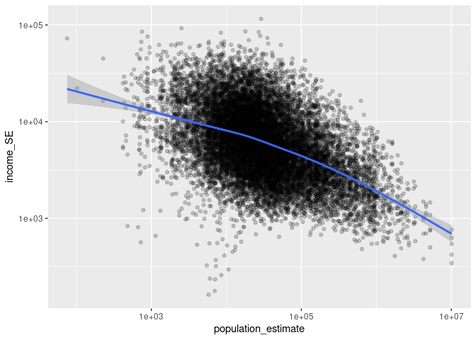

US Income
================
Ariel
2025-04-03

- [Grading Rubric](#grading-rubric)
  - [Individual](#individual)
  - [Submission](#submission)
- [Setup](#setup)
  - [**q1** Load the population data from c06; simply replace
    `filename_pop`
    below.](#q1-load-the-population-data-from-c06-simply-replace-filename_pop-below)
  - [**q2** Obtain median income data from the Census
    Bureau:](#q2-obtain-median-income-data-from-the-census-bureau)
  - [**q3** Tidy the `df_income` dataset by completing the code below.
    Pivot and rename the columns to arrive at the column names
    `id, geographic_area_name, category, income_estimate, income_moe`.](#q3-tidy-the-df_income-dataset-by-completing-the-code-below-pivot-and-rename-the-columns-to-arrive-at-the-column-names-id-geographic_area_name-category-income_estimate-income_moe)
  - [**q4** Convert the margin of error to standard error. Additionally,
    compute a 99% confidence interval on income, and normalize the
    standard error to `income_CV = income_SE / income_estimate`. Provide
    these columns with the names
    `income_SE, income_lo, income_hi, income_CV`.](#q4-convert-the-margin-of-error-to-standard-error-additionally-compute-a-99-confidence-interval-on-income-and-normalize-the-standard-error-to-income_cv--income_se--income_estimate-provide-these-columns-with-the-names-income_se-income_lo-income_hi-income_cv)
  - [**q5** Join `df_q4` and `df_pop`.](#q5-join-df_q4-and-df_pop)
- [Analysis](#analysis)
  - [**q6** Study the following graph, making sure to note what you can
    *and can’t* conclude based on the estimates and confidence
    intervals. Document your observations below and answer the
    questions.](#q6-study-the-following-graph-making-sure-to-note-what-you-can-and-cant-conclude-based-on-the-estimates-and-confidence-intervals-document-your-observations-below-and-answer-the-questions)
  - [**q7** Plot the standard error against population for all counties.
    Create a visual that effectively highlights the trends in the data.
    Answer the questions under *observations*
    below.](#q7-plot-the-standard-error-against-population-for-all-counties-create-a-visual-that-effectively-highlights-the-trends-in-the-data-answer-the-questions-under-observations-below)
- [Going Further](#going-further)
  - [**q8** Pose your own question about the data. Create a
    visualization (or table) here, and document your
    observations.](#q8-pose-your-own-question-about-the-data-create-a-visualization-or-table-here-and-document-your-observations)
- [References](#references)

*Purpose*: We’ve been learning how to quantify uncertainty in estimates
through the exercises; now its time to put those skills to use studying
real data. In this challenge we’ll use concepts like confidence
intervals to help us make sense of census data.

*Reading*: - [Using ACS Estimates and Margin of
Error](https://www.census.gov/data/academy/webinars/2020/calculating-margins-of-error-acs.html)
(Optional, see the PDF on the page) - [Patterns and Causes of
Uncertainty in the American Community
Survey](https://www.sciencedirect.com/science/article/pii/S0143622813002518?casa_token=VddzQ1-spHMAAAAA:FTq92LXgiPVloJUVjnHs8Ma1HwvPigisAYtzfqaGbbRRwoknNq56Y2IzszmGgIGH4JAPzQN0)
(Optional, particularly the *Uncertainty in surveys* section under the
Introduction.)

<!-- include-rubric -->

# Grading Rubric

<!-- -------------------------------------------------- -->

Unlike exercises, **challenges will be graded**. The following rubrics
define how you will be graded, both on an individual and team basis.

## Individual

<!-- ------------------------- -->

| Category | Needs Improvement | Satisfactory |
|----|----|----|
| Effort | Some task **q**’s left unattempted | All task **q**’s attempted |
| Observed | Did not document observations, or observations incorrect | Documented correct observations based on analysis |
| Supported | Some observations not clearly supported by analysis | All observations clearly supported by analysis (table, graph, etc.) |
| Assessed | Observations include claims not supported by the data, or reflect a level of certainty not warranted by the data | Observations are appropriately qualified by the quality & relevance of the data and (in)conclusiveness of the support |
| Specified | Uses the phrase “more data are necessary” without clarification | Any statement that “more data are necessary” specifies which *specific* data are needed to answer what *specific* question |
| Code Styled | Violations of the [style guide](https://style.tidyverse.org/) hinder readability | Code sufficiently close to the [style guide](https://style.tidyverse.org/) |

## Submission

<!-- ------------------------- -->

Make sure to commit both the challenge report (`report.md` file) and
supporting files (`report_files/` folder) when you are done! Then submit
a link to Canvas. **Your Challenge submission is not complete without
all files uploaded to GitHub.**

# Setup

<!-- ----------------------------------------------------------------------- -->

``` r
library(tidyverse)
```

    ## ── Attaching core tidyverse packages ──────────────────────── tidyverse 2.0.0 ──
    ## ✔ dplyr     1.1.4     ✔ readr     2.1.5
    ## ✔ forcats   1.0.0     ✔ stringr   1.5.1
    ## ✔ ggplot2   3.5.1     ✔ tibble    3.2.1
    ## ✔ lubridate 1.9.4     ✔ tidyr     1.3.1
    ## ✔ purrr     1.0.2     
    ## ── Conflicts ────────────────────────────────────────── tidyverse_conflicts() ──
    ## ✖ dplyr::filter() masks stats::filter()
    ## ✖ dplyr::lag()    masks stats::lag()
    ## ℹ Use the conflicted package (<http://conflicted.r-lib.org/>) to force all conflicts to become errors

### **q1** Load the population data from c06; simply replace `filename_pop` below.

``` r
## TODO: Give the filename for your copy of Table B01003
filename_pop <- 'data/2018_use/pop_data.csv'

## NOTE: No need to edit
df_pop <-
  read_csv(
    filename_pop,
    skip = 1,
  ) %>% 
  rename(
    population_estimate = `Estimate!!Total`
  )
```

    ## New names:
    ## Rows: 3220 Columns: 5
    ## ── Column specification
    ## ──────────────────────────────────────────────────────── Delimiter: "," chr
    ## (3): Geography, Geographic Area Name, Margin of Error!!Total dbl (1):
    ## Estimate!!Total lgl (1): ...5
    ## ℹ Use `spec()` to retrieve the full column specification for this data. ℹ
    ## Specify the column types or set `show_col_types = FALSE` to quiet this message.
    ## • `` -> `...5`

``` r
glimpse(df_pop)
```

    ## Rows: 3,220
    ## Columns: 5
    ## $ Geography                <chr> "0500000US01001", "0500000US01003", "0500000U…
    ## $ `Geographic Area Name`   <chr> "Autauga County, Alabama", "Baldwin County, A…
    ## $ population_estimate      <dbl> 55200, 208107, 25782, 22527, 57645, 10352, 20…
    ## $ `Margin of Error!!Total` <chr> "*****", "*****", "*****", "*****", "*****", …
    ## $ ...5                     <lgl> NA, NA, NA, NA, NA, NA, NA, NA, NA, NA, NA, N…

You might wonder why the `Margin of Error` in the population estimates
is listed as `*****`. From the [documentation (PDF
link)](https://www.google.com/url?sa=t&rct=j&q=&esrc=s&source=web&cd=&cad=rja&uact=8&ved=2ahUKEwj81Omy16TrAhXsguAKHTzKDQEQFjABegQIBxAB&url=https%3A%2F%2Fwww2.census.gov%2Fprograms-surveys%2Facs%2Ftech_docs%2Faccuracy%2FMultiyearACSAccuracyofData2018.pdf%3F&usg=AOvVaw2TOrVuBDlkDI2gde6ugce_)
for the ACS:

> If the margin of error is displayed as ‘\*\*\*\*\*’ (five asterisks),
> the estimate has been controlled to be equal to a fixed value and so
> it has no sampling error. A standard error of zero should be used for
> these controlled estimates when completing calculations, such as those
> in the following section.

This means that for cases listed as `*****` the US Census Bureau
recommends treating the margin of error (and thus standard error) as
zero.

### **q2** Obtain median income data from the Census Bureau:

- `Filter > Topics > Income and Poverty > Income and Poverty`
- `Filter > Geography > County > All counties in United States`
- Look for `Median Income in the Past 12 Months` (Table S1903)
- Download the 2018 5-year ACS estimates; save to your `data` folder and
  add the filename below.

``` r
## TODO: Give the filename for your copy of Table S1903
filename_income <- 'data/median-income/median_income_data.csv'
## NOTE: No need to edit
df_income <-
  read_csv(filename_income, skip = 1)
```

    ## New names:
    ## • `` -> `...243`

    ## Warning: One or more parsing issues, call `problems()` on your data frame for details,
    ## e.g.:
    ##   dat <- vroom(...)
    ##   problems(dat)

    ## Rows: 3220 Columns: 243
    ## ── Column specification ────────────────────────────────────────────────────────
    ## Delimiter: ","
    ## chr  (66): Geography, Geographic Area Name, Estimate!!Median income (dollars...
    ## dbl (176): Estimate!!Number!!HOUSEHOLD INCOME BY RACE AND HISPANIC OR LATINO...
    ## lgl   (1): ...243
    ## 
    ## ℹ Use `spec()` to retrieve the full column specification for this data.
    ## ℹ Specify the column types or set `show_col_types = FALSE` to quiet this message.

``` r
glimpse(df_income)
```

    ## Rows: 3,220
    ## Columns: 243
    ## $ Geography                                                                                                                                                                                 <chr> …
    ## $ `Geographic Area Name`                                                                                                                                                                    <chr> …
    ## $ `Estimate!!Number!!HOUSEHOLD INCOME BY RACE AND HISPANIC OR LATINO ORIGIN OF HOUSEHOLDER!!Households`                                                                                     <dbl> …
    ## $ `Margin of Error!!Number MOE!!HOUSEHOLD INCOME BY RACE AND HISPANIC OR LATINO ORIGIN OF HOUSEHOLDER!!Households`                                                                          <dbl> …
    ## $ `Estimate!!Number!!HOUSEHOLD INCOME BY RACE AND HISPANIC OR LATINO ORIGIN OF HOUSEHOLDER!!Households!!One race--!!White`                                                                  <dbl> …
    ## $ `Margin of Error!!Number MOE!!HOUSEHOLD INCOME BY RACE AND HISPANIC OR LATINO ORIGIN OF HOUSEHOLDER!!Households!!One race--!!White`                                                       <dbl> …
    ## $ `Estimate!!Number!!HOUSEHOLD INCOME BY RACE AND HISPANIC OR LATINO ORIGIN OF HOUSEHOLDER!!Households!!One race--!!Black or African American`                                              <dbl> …
    ## $ `Margin of Error!!Number MOE!!HOUSEHOLD INCOME BY RACE AND HISPANIC OR LATINO ORIGIN OF HOUSEHOLDER!!Households!!One race--!!Black or African American`                                   <dbl> …
    ## $ `Estimate!!Number!!HOUSEHOLD INCOME BY RACE AND HISPANIC OR LATINO ORIGIN OF HOUSEHOLDER!!Households!!One race--!!American Indian and Alaska Native`                                      <dbl> …
    ## $ `Margin of Error!!Number MOE!!HOUSEHOLD INCOME BY RACE AND HISPANIC OR LATINO ORIGIN OF HOUSEHOLDER!!Households!!One race--!!American Indian and Alaska Native`                           <dbl> …
    ## $ `Estimate!!Number!!HOUSEHOLD INCOME BY RACE AND HISPANIC OR LATINO ORIGIN OF HOUSEHOLDER!!Households!!One race--!!Asian`                                                                  <dbl> …
    ## $ `Margin of Error!!Number MOE!!HOUSEHOLD INCOME BY RACE AND HISPANIC OR LATINO ORIGIN OF HOUSEHOLDER!!Households!!One race--!!Asian`                                                       <dbl> …
    ## $ `Estimate!!Number!!HOUSEHOLD INCOME BY RACE AND HISPANIC OR LATINO ORIGIN OF HOUSEHOLDER!!Households!!One race--!!Native Hawaiian and Other Pacific Islander`                             <dbl> …
    ## $ `Margin of Error!!Number MOE!!HOUSEHOLD INCOME BY RACE AND HISPANIC OR LATINO ORIGIN OF HOUSEHOLDER!!Households!!One race--!!Native Hawaiian and Other Pacific Islander`                  <dbl> …
    ## $ `Estimate!!Number!!HOUSEHOLD INCOME BY RACE AND HISPANIC OR LATINO ORIGIN OF HOUSEHOLDER!!Households!!One race--!!Some other race`                                                        <dbl> …
    ## $ `Margin of Error!!Number MOE!!HOUSEHOLD INCOME BY RACE AND HISPANIC OR LATINO ORIGIN OF HOUSEHOLDER!!Households!!One race--!!Some other race`                                             <dbl> …
    ## $ `Estimate!!Number!!HOUSEHOLD INCOME BY RACE AND HISPANIC OR LATINO ORIGIN OF HOUSEHOLDER!!Households!!Two or more races`                                                                  <dbl> …
    ## $ `Margin of Error!!Number MOE!!HOUSEHOLD INCOME BY RACE AND HISPANIC OR LATINO ORIGIN OF HOUSEHOLDER!!Households!!Two or more races`                                                       <dbl> …
    ## $ `Estimate!!Number!!HOUSEHOLD INCOME BY RACE AND HISPANIC OR LATINO ORIGIN OF HOUSEHOLDER!!Households!!Hispanic or Latino origin (of any race)`                                            <dbl> …
    ## $ `Margin of Error!!Number MOE!!HOUSEHOLD INCOME BY RACE AND HISPANIC OR LATINO ORIGIN OF HOUSEHOLDER!!Households!!Hispanic or Latino origin (of any race)`                                 <dbl> …
    ## $ `Estimate!!Number!!HOUSEHOLD INCOME BY RACE AND HISPANIC OR LATINO ORIGIN OF HOUSEHOLDER!!Households!!White alone, not Hispanic or Latino`                                                <dbl> …
    ## $ `Margin of Error!!Number MOE!!HOUSEHOLD INCOME BY RACE AND HISPANIC OR LATINO ORIGIN OF HOUSEHOLDER!!Households!!White alone, not Hispanic or Latino`                                     <dbl> …
    ## $ `Estimate!!Number!!HOUSEHOLD INCOME BY AGE OF HOUSEHOLDER!!15 to 24 years`                                                                                                                <dbl> …
    ## $ `Margin of Error!!Number MOE!!HOUSEHOLD INCOME BY AGE OF HOUSEHOLDER!!15 to 24 years`                                                                                                     <dbl> …
    ## $ `Estimate!!Number!!HOUSEHOLD INCOME BY AGE OF HOUSEHOLDER!!25 to 44 years`                                                                                                                <dbl> …
    ## $ `Margin of Error!!Number MOE!!HOUSEHOLD INCOME BY AGE OF HOUSEHOLDER!!25 to 44 years`                                                                                                     <dbl> …
    ## $ `Estimate!!Number!!HOUSEHOLD INCOME BY AGE OF HOUSEHOLDER!!45 to 64 years`                                                                                                                <dbl> …
    ## $ `Margin of Error!!Number MOE!!HOUSEHOLD INCOME BY AGE OF HOUSEHOLDER!!45 to 64 years`                                                                                                     <dbl> …
    ## $ `Estimate!!Number!!HOUSEHOLD INCOME BY AGE OF HOUSEHOLDER!!65 years and over`                                                                                                             <dbl> …
    ## $ `Margin of Error!!Number MOE!!HOUSEHOLD INCOME BY AGE OF HOUSEHOLDER!!65 years and over`                                                                                                  <dbl> …
    ## $ `Estimate!!Number!!FAMILIES!!Families`                                                                                                                                                    <dbl> …
    ## $ `Margin of Error!!Number MOE!!FAMILIES!!Families`                                                                                                                                         <dbl> …
    ## $ `Estimate!!Number!!FAMILIES!!Families!!With own children of householder under 18 years`                                                                                                   <dbl> …
    ## $ `Margin of Error!!Number MOE!!FAMILIES!!Families!!With own children of householder under 18 years`                                                                                        <dbl> …
    ## $ `Estimate!!Number!!FAMILIES!!Families!!With no own children of householder under 18 years`                                                                                                <dbl> …
    ## $ `Margin of Error!!Number MOE!!FAMILIES!!Families!!With no own children of householder under 18 years`                                                                                     <dbl> …
    ## $ `Estimate!!Number!!FAMILIES!!Families!!Married-couple families`                                                                                                                           <dbl> …
    ## $ `Margin of Error!!Number MOE!!FAMILIES!!Families!!Married-couple families`                                                                                                                <dbl> …
    ## $ `Estimate!!Number!!FAMILIES!!Families!!Married-couple families!!With own children under 18 years`                                                                                         <dbl> …
    ## $ `Margin of Error!!Number MOE!!FAMILIES!!Families!!Married-couple families!!With own children under 18 years`                                                                              <dbl> …
    ## $ `Estimate!!Number!!FAMILIES!!Families!!Female householder, no husband present`                                                                                                            <dbl> …
    ## $ `Margin of Error!!Number MOE!!FAMILIES!!Families!!Female householder, no husband present`                                                                                                 <dbl> …
    ## $ `Estimate!!Number!!FAMILIES!!Families!!Female householder, no husband present!!With own children under 18 years`                                                                          <dbl> …
    ## $ `Margin of Error!!Number MOE!!FAMILIES!!Families!!Female householder, no husband present!!With own children under 18 years`                                                               <dbl> …
    ## $ `Estimate!!Number!!FAMILIES!!Families!!Male householder, no wife present`                                                                                                                 <dbl> …
    ## $ `Margin of Error!!Number MOE!!FAMILIES!!Families!!Male householder, no wife present`                                                                                                      <dbl> …
    ## $ `Estimate!!Number!!FAMILIES!!Families!!Male householder, no wife present!!With own children under 18 years`                                                                               <dbl> …
    ## $ `Margin of Error!!Number MOE!!FAMILIES!!Families!!Male householder, no wife present!!With own children under 18 years`                                                                    <dbl> …
    ## $ `Estimate!!Number!!FAMILY INCOME BY FAMILY SIZE!!2-person families`                                                                                                                       <dbl> …
    ## $ `Margin of Error!!Number MOE!!FAMILY INCOME BY FAMILY SIZE!!2-person families`                                                                                                            <dbl> …
    ## $ `Estimate!!Number!!FAMILY INCOME BY FAMILY SIZE!!3-person families`                                                                                                                       <dbl> …
    ## $ `Margin of Error!!Number MOE!!FAMILY INCOME BY FAMILY SIZE!!3-person families`                                                                                                            <dbl> …
    ## $ `Estimate!!Number!!FAMILY INCOME BY FAMILY SIZE!!4-person families`                                                                                                                       <dbl> …
    ## $ `Margin of Error!!Number MOE!!FAMILY INCOME BY FAMILY SIZE!!4-person families`                                                                                                            <dbl> …
    ## $ `Estimate!!Number!!FAMILY INCOME BY FAMILY SIZE!!5-person families`                                                                                                                       <dbl> …
    ## $ `Margin of Error!!Number MOE!!FAMILY INCOME BY FAMILY SIZE!!5-person families`                                                                                                            <dbl> …
    ## $ `Estimate!!Number!!FAMILY INCOME BY FAMILY SIZE!!6-person families`                                                                                                                       <dbl> …
    ## $ `Margin of Error!!Number MOE!!FAMILY INCOME BY FAMILY SIZE!!6-person families`                                                                                                            <dbl> …
    ## $ `Estimate!!Number!!FAMILY INCOME BY FAMILY SIZE!!7-or-more person families`                                                                                                               <dbl> …
    ## $ `Margin of Error!!Number MOE!!FAMILY INCOME BY FAMILY SIZE!!7-or-more person families`                                                                                                    <dbl> …
    ## $ `Estimate!!Number!!FAMILY INCOME BY NUMBER OF EARNERS!!No earners`                                                                                                                        <dbl> …
    ## $ `Margin of Error!!Number MOE!!FAMILY INCOME BY NUMBER OF EARNERS!!No earners`                                                                                                             <dbl> …
    ## $ `Estimate!!Number!!FAMILY INCOME BY NUMBER OF EARNERS!!1 earner`                                                                                                                          <dbl> …
    ## $ `Margin of Error!!Number MOE!!FAMILY INCOME BY NUMBER OF EARNERS!!1 earner`                                                                                                               <dbl> …
    ## $ `Estimate!!Number!!FAMILY INCOME BY NUMBER OF EARNERS!!2 earners`                                                                                                                         <dbl> …
    ## $ `Margin of Error!!Number MOE!!FAMILY INCOME BY NUMBER OF EARNERS!!2 earners`                                                                                                              <dbl> …
    ## $ `Estimate!!Number!!FAMILY INCOME BY NUMBER OF EARNERS!!3 or more earners`                                                                                                                 <dbl> …
    ## $ `Margin of Error!!Number MOE!!FAMILY INCOME BY NUMBER OF EARNERS!!3 or more earners`                                                                                                      <dbl> …
    ## $ `Estimate!!Number!!NONFAMILY HOUSEHOLDS!!Nonfamily households`                                                                                                                            <dbl> …
    ## $ `Margin of Error!!Number MOE!!NONFAMILY HOUSEHOLDS!!Nonfamily households`                                                                                                                 <dbl> …
    ## $ `Estimate!!Number!!NONFAMILY HOUSEHOLDS!!Nonfamily households!!Female householder`                                                                                                        <dbl> …
    ## $ `Margin of Error!!Number MOE!!NONFAMILY HOUSEHOLDS!!Nonfamily households!!Female householder`                                                                                             <dbl> …
    ## $ `Estimate!!Number!!NONFAMILY HOUSEHOLDS!!Nonfamily households!!Female householder!!Living alone`                                                                                          <dbl> …
    ## $ `Margin of Error!!Number MOE!!NONFAMILY HOUSEHOLDS!!Nonfamily households!!Female householder!!Living alone`                                                                               <dbl> …
    ## $ `Estimate!!Number!!NONFAMILY HOUSEHOLDS!!Nonfamily households!!Female householder!!Not living alone`                                                                                      <dbl> …
    ## $ `Margin of Error!!Number MOE!!NONFAMILY HOUSEHOLDS!!Nonfamily households!!Female householder!!Not living alone`                                                                           <dbl> …
    ## $ `Estimate!!Number!!NONFAMILY HOUSEHOLDS!!Nonfamily households!!Male householder`                                                                                                          <dbl> …
    ## $ `Margin of Error!!Number MOE!!NONFAMILY HOUSEHOLDS!!Nonfamily households!!Male householder`                                                                                               <dbl> …
    ## $ `Estimate!!Number!!NONFAMILY HOUSEHOLDS!!Nonfamily households!!Male householder!!Living alone`                                                                                            <dbl> …
    ## $ `Margin of Error!!Number MOE!!NONFAMILY HOUSEHOLDS!!Nonfamily households!!Male householder!!Living alone`                                                                                 <dbl> …
    ## $ `Estimate!!Number!!NONFAMILY HOUSEHOLDS!!Nonfamily households!!Male householder!!Not living alone`                                                                                        <dbl> …
    ## $ `Margin of Error!!Number MOE!!NONFAMILY HOUSEHOLDS!!Nonfamily households!!Male householder!!Not living alone`                                                                             <dbl> …
    ## $ `Estimate!!Percent Distribution!!HOUSEHOLD INCOME BY RACE AND HISPANIC OR LATINO ORIGIN OF HOUSEHOLDER!!Households`                                                                       <dbl> …
    ## $ `Margin of Error!!Percent Distribution MOE!!HOUSEHOLD INCOME BY RACE AND HISPANIC OR LATINO ORIGIN OF HOUSEHOLDER!!Households`                                                            <dbl> …
    ## $ `Estimate!!Median income (dollars)!!HOUSEHOLD INCOME BY RACE AND HISPANIC OR LATINO ORIGIN OF HOUSEHOLDER!!Households`                                                                    <dbl> …
    ## $ `Margin of Error!!Median income (dollars) MOE!!HOUSEHOLD INCOME BY RACE AND HISPANIC OR LATINO ORIGIN OF HOUSEHOLDER!!Households`                                                         <dbl> …
    ## $ `Estimate!!Percent Distribution!!HOUSEHOLD INCOME BY RACE AND HISPANIC OR LATINO ORIGIN OF HOUSEHOLDER!!Households!!One race--!!White`                                                    <dbl> …
    ## $ `Margin of Error!!Percent Distribution MOE!!HOUSEHOLD INCOME BY RACE AND HISPANIC OR LATINO ORIGIN OF HOUSEHOLDER!!Households!!One race--!!White`                                         <dbl> …
    ## $ `Estimate!!Median income (dollars)!!HOUSEHOLD INCOME BY RACE AND HISPANIC OR LATINO ORIGIN OF HOUSEHOLDER!!Households!!One race--!!White`                                                 <dbl> …
    ## $ `Margin of Error!!Median income (dollars) MOE!!HOUSEHOLD INCOME BY RACE AND HISPANIC OR LATINO ORIGIN OF HOUSEHOLDER!!Households!!One race--!!White`                                      <dbl> …
    ## $ `Estimate!!Percent Distribution!!HOUSEHOLD INCOME BY RACE AND HISPANIC OR LATINO ORIGIN OF HOUSEHOLDER!!Households!!One race--!!Black or African American`                                <dbl> …
    ## $ `Margin of Error!!Percent Distribution MOE!!HOUSEHOLD INCOME BY RACE AND HISPANIC OR LATINO ORIGIN OF HOUSEHOLDER!!Households!!One race--!!Black or African American`                     <dbl> …
    ## $ `Estimate!!Median income (dollars)!!HOUSEHOLD INCOME BY RACE AND HISPANIC OR LATINO ORIGIN OF HOUSEHOLDER!!Households!!One race--!!Black or African American`                             <chr> …
    ## $ `Margin of Error!!Median income (dollars) MOE!!HOUSEHOLD INCOME BY RACE AND HISPANIC OR LATINO ORIGIN OF HOUSEHOLDER!!Households!!One race--!!Black or African American`                  <chr> …
    ## $ `Estimate!!Percent Distribution!!HOUSEHOLD INCOME BY RACE AND HISPANIC OR LATINO ORIGIN OF HOUSEHOLDER!!Households!!One race--!!American Indian and Alaska Native`                        <dbl> …
    ## $ `Margin of Error!!Percent Distribution MOE!!HOUSEHOLD INCOME BY RACE AND HISPANIC OR LATINO ORIGIN OF HOUSEHOLDER!!Households!!One race--!!American Indian and Alaska Native`             <dbl> …
    ## $ `Estimate!!Median income (dollars)!!HOUSEHOLD INCOME BY RACE AND HISPANIC OR LATINO ORIGIN OF HOUSEHOLDER!!Households!!One race--!!American Indian and Alaska Native`                     <chr> …
    ## $ `Margin of Error!!Median income (dollars) MOE!!HOUSEHOLD INCOME BY RACE AND HISPANIC OR LATINO ORIGIN OF HOUSEHOLDER!!Households!!One race--!!American Indian and Alaska Native`          <chr> …
    ## $ `Estimate!!Percent Distribution!!HOUSEHOLD INCOME BY RACE AND HISPANIC OR LATINO ORIGIN OF HOUSEHOLDER!!Households!!One race--!!Asian`                                                    <dbl> …
    ## $ `Margin of Error!!Percent Distribution MOE!!HOUSEHOLD INCOME BY RACE AND HISPANIC OR LATINO ORIGIN OF HOUSEHOLDER!!Households!!One race--!!Asian`                                         <dbl> …
    ## $ `Estimate!!Median income (dollars)!!HOUSEHOLD INCOME BY RACE AND HISPANIC OR LATINO ORIGIN OF HOUSEHOLDER!!Households!!One race--!!Asian`                                                 <chr> …
    ## $ `Margin of Error!!Median income (dollars) MOE!!HOUSEHOLD INCOME BY RACE AND HISPANIC OR LATINO ORIGIN OF HOUSEHOLDER!!Households!!One race--!!Asian`                                      <chr> …
    ## $ `Estimate!!Percent Distribution!!HOUSEHOLD INCOME BY RACE AND HISPANIC OR LATINO ORIGIN OF HOUSEHOLDER!!Households!!One race--!!Native Hawaiian and Other Pacific Islander`               <dbl> …
    ## $ `Margin of Error!!Percent Distribution MOE!!HOUSEHOLD INCOME BY RACE AND HISPANIC OR LATINO ORIGIN OF HOUSEHOLDER!!Households!!One race--!!Native Hawaiian and Other Pacific Islander`    <dbl> …
    ## $ `Estimate!!Median income (dollars)!!HOUSEHOLD INCOME BY RACE AND HISPANIC OR LATINO ORIGIN OF HOUSEHOLDER!!Households!!One race--!!Native Hawaiian and Other Pacific Islander`            <chr> …
    ## $ `Margin of Error!!Median income (dollars) MOE!!HOUSEHOLD INCOME BY RACE AND HISPANIC OR LATINO ORIGIN OF HOUSEHOLDER!!Households!!One race--!!Native Hawaiian and Other Pacific Islander` <chr> …
    ## $ `Estimate!!Percent Distribution!!HOUSEHOLD INCOME BY RACE AND HISPANIC OR LATINO ORIGIN OF HOUSEHOLDER!!Households!!One race--!!Some other race`                                          <dbl> …
    ## $ `Margin of Error!!Percent Distribution MOE!!HOUSEHOLD INCOME BY RACE AND HISPANIC OR LATINO ORIGIN OF HOUSEHOLDER!!Households!!One race--!!Some other race`                               <dbl> …
    ## $ `Estimate!!Median income (dollars)!!HOUSEHOLD INCOME BY RACE AND HISPANIC OR LATINO ORIGIN OF HOUSEHOLDER!!Households!!One race--!!Some other race`                                       <chr> …
    ## $ `Margin of Error!!Median income (dollars) MOE!!HOUSEHOLD INCOME BY RACE AND HISPANIC OR LATINO ORIGIN OF HOUSEHOLDER!!Households!!One race--!!Some other race`                            <chr> …
    ## $ `Estimate!!Percent Distribution!!HOUSEHOLD INCOME BY RACE AND HISPANIC OR LATINO ORIGIN OF HOUSEHOLDER!!Households!!Two or more races`                                                    <dbl> …
    ## $ `Margin of Error!!Percent Distribution MOE!!HOUSEHOLD INCOME BY RACE AND HISPANIC OR LATINO ORIGIN OF HOUSEHOLDER!!Households!!Two or more races`                                         <dbl> …
    ## $ `Estimate!!Median income (dollars)!!HOUSEHOLD INCOME BY RACE AND HISPANIC OR LATINO ORIGIN OF HOUSEHOLDER!!Households!!Two or more races`                                                 <chr> …
    ## $ `Margin of Error!!Median income (dollars) MOE!!HOUSEHOLD INCOME BY RACE AND HISPANIC OR LATINO ORIGIN OF HOUSEHOLDER!!Households!!Two or more races`                                      <chr> …
    ## $ `Estimate!!Percent Distribution!!HOUSEHOLD INCOME BY RACE AND HISPANIC OR LATINO ORIGIN OF HOUSEHOLDER!!Households!!Hispanic or Latino origin (of any race)`                              <dbl> …
    ## $ `Margin of Error!!Percent Distribution MOE!!HOUSEHOLD INCOME BY RACE AND HISPANIC OR LATINO ORIGIN OF HOUSEHOLDER!!Households!!Hispanic or Latino origin (of any race)`                   <dbl> …
    ## $ `Estimate!!Median income (dollars)!!HOUSEHOLD INCOME BY RACE AND HISPANIC OR LATINO ORIGIN OF HOUSEHOLDER!!Households!!Hispanic or Latino origin (of any race)`                           <chr> …
    ## $ `Margin of Error!!Median income (dollars) MOE!!HOUSEHOLD INCOME BY RACE AND HISPANIC OR LATINO ORIGIN OF HOUSEHOLDER!!Households!!Hispanic or Latino origin (of any race)`                <chr> …
    ## $ `Estimate!!Percent Distribution!!HOUSEHOLD INCOME BY RACE AND HISPANIC OR LATINO ORIGIN OF HOUSEHOLDER!!Households!!White alone, not Hispanic or Latino`                                  <dbl> …
    ## $ `Margin of Error!!Percent Distribution MOE!!HOUSEHOLD INCOME BY RACE AND HISPANIC OR LATINO ORIGIN OF HOUSEHOLDER!!Households!!White alone, not Hispanic or Latino`                       <dbl> …
    ## $ `Estimate!!Median income (dollars)!!HOUSEHOLD INCOME BY RACE AND HISPANIC OR LATINO ORIGIN OF HOUSEHOLDER!!Households!!White alone, not Hispanic or Latino`                               <chr> …
    ## $ `Margin of Error!!Median income (dollars) MOE!!HOUSEHOLD INCOME BY RACE AND HISPANIC OR LATINO ORIGIN OF HOUSEHOLDER!!Households!!White alone, not Hispanic or Latino`                    <chr> …
    ## $ `Estimate!!Percent Distribution!!HOUSEHOLD INCOME BY AGE OF HOUSEHOLDER!!15 to 24 years`                                                                                                  <dbl> …
    ## $ `Margin of Error!!Percent Distribution MOE!!HOUSEHOLD INCOME BY AGE OF HOUSEHOLDER!!15 to 24 years`                                                                                       <dbl> …
    ## $ `Estimate!!Median income (dollars)!!HOUSEHOLD INCOME BY AGE OF HOUSEHOLDER!!15 to 24 years`                                                                                               <chr> …
    ## $ `Margin of Error!!Median income (dollars) MOE!!HOUSEHOLD INCOME BY AGE OF HOUSEHOLDER!!15 to 24 years`                                                                                    <chr> …
    ## $ `Estimate!!Percent Distribution!!HOUSEHOLD INCOME BY AGE OF HOUSEHOLDER!!25 to 44 years`                                                                                                  <dbl> …
    ## $ `Margin of Error!!Percent Distribution MOE!!HOUSEHOLD INCOME BY AGE OF HOUSEHOLDER!!25 to 44 years`                                                                                       <dbl> …
    ## $ `Estimate!!Median income (dollars)!!HOUSEHOLD INCOME BY AGE OF HOUSEHOLDER!!25 to 44 years`                                                                                               <chr> …
    ## $ `Margin of Error!!Median income (dollars) MOE!!HOUSEHOLD INCOME BY AGE OF HOUSEHOLDER!!25 to 44 years`                                                                                    <chr> …
    ## $ `Estimate!!Percent Distribution!!HOUSEHOLD INCOME BY AGE OF HOUSEHOLDER!!45 to 64 years`                                                                                                  <dbl> …
    ## $ `Margin of Error!!Percent Distribution MOE!!HOUSEHOLD INCOME BY AGE OF HOUSEHOLDER!!45 to 64 years`                                                                                       <dbl> …
    ## $ `Estimate!!Median income (dollars)!!HOUSEHOLD INCOME BY AGE OF HOUSEHOLDER!!45 to 64 years`                                                                                               <dbl> …
    ## $ `Margin of Error!!Median income (dollars) MOE!!HOUSEHOLD INCOME BY AGE OF HOUSEHOLDER!!45 to 64 years`                                                                                    <dbl> …
    ## $ `Estimate!!Percent Distribution!!HOUSEHOLD INCOME BY AGE OF HOUSEHOLDER!!65 years and over`                                                                                               <dbl> …
    ## $ `Margin of Error!!Percent Distribution MOE!!HOUSEHOLD INCOME BY AGE OF HOUSEHOLDER!!65 years and over`                                                                                    <dbl> …
    ## $ `Estimate!!Median income (dollars)!!HOUSEHOLD INCOME BY AGE OF HOUSEHOLDER!!65 years and over`                                                                                            <chr> …
    ## $ `Margin of Error!!Median income (dollars) MOE!!HOUSEHOLD INCOME BY AGE OF HOUSEHOLDER!!65 years and over`                                                                                 <chr> …
    ## $ `Estimate!!Percent Distribution!!FAMILIES!!Families`                                                                                                                                      <dbl> …
    ## $ `Margin of Error!!Percent Distribution MOE!!FAMILIES!!Families`                                                                                                                           <dbl> …
    ## $ `Estimate!!Median income (dollars)!!FAMILIES!!Families`                                                                                                                                   <dbl> …
    ## $ `Margin of Error!!Median income (dollars) MOE!!FAMILIES!!Families`                                                                                                                        <dbl> …
    ## $ `Estimate!!Percent Distribution!!FAMILIES!!Families!!With own children of householder under 18 years`                                                                                     <dbl> …
    ## $ `Margin of Error!!Percent Distribution MOE!!FAMILIES!!Families!!With own children of householder under 18 years`                                                                          <dbl> …
    ## $ `Estimate!!Median income (dollars)!!FAMILIES!!Families!!With own children of householder under 18 years`                                                                                  <chr> …
    ## $ `Margin of Error!!Median income (dollars) MOE!!FAMILIES!!Families!!With own children of householder under 18 years`                                                                       <chr> …
    ## $ `Estimate!!Percent Distribution!!FAMILIES!!Families!!With no own children of householder under 18 years`                                                                                  <dbl> …
    ## $ `Margin of Error!!Percent Distribution MOE!!FAMILIES!!Families!!With no own children of householder under 18 years`                                                                       <dbl> …
    ## $ `Estimate!!Median income (dollars)!!FAMILIES!!Families!!With no own children of householder under 18 years`                                                                               <dbl> …
    ## $ `Margin of Error!!Median income (dollars) MOE!!FAMILIES!!Families!!With no own children of householder under 18 years`                                                                    <dbl> …
    ## $ `Estimate!!Percent Distribution!!FAMILIES!!Families!!Married-couple families`                                                                                                             <dbl> …
    ## $ `Margin of Error!!Percent Distribution MOE!!FAMILIES!!Families!!Married-couple families`                                                                                                  <dbl> …
    ## $ `Estimate!!Median income (dollars)!!FAMILIES!!Families!!Married-couple families`                                                                                                          <dbl> …
    ## $ `Margin of Error!!Median income (dollars) MOE!!FAMILIES!!Families!!Married-couple families`                                                                                               <dbl> …
    ## $ `Estimate!!Percent Distribution!!FAMILIES!!Families!!Married-couple families!!With own children under 18 years`                                                                           <dbl> …
    ## $ `Margin of Error!!Percent Distribution MOE!!FAMILIES!!Families!!Married-couple families!!With own children under 18 years`                                                                <dbl> …
    ## $ `Estimate!!Median income (dollars)!!FAMILIES!!Families!!Married-couple families!!With own children under 18 years`                                                                        <chr> …
    ## $ `Margin of Error!!Median income (dollars) MOE!!FAMILIES!!Families!!Married-couple families!!With own children under 18 years`                                                             <chr> …
    ## $ `Estimate!!Percent Distribution!!FAMILIES!!Families!!Female householder, no husband present`                                                                                              <dbl> …
    ## $ `Margin of Error!!Percent Distribution MOE!!FAMILIES!!Families!!Female householder, no husband present`                                                                                   <dbl> …
    ## $ `Estimate!!Median income (dollars)!!FAMILIES!!Families!!Female householder, no husband present`                                                                                           <chr> …
    ## $ `Margin of Error!!Median income (dollars) MOE!!FAMILIES!!Families!!Female householder, no husband present`                                                                                <chr> …
    ## $ `Estimate!!Percent Distribution!!FAMILIES!!Families!!Female householder, no husband present!!With own children under 18 years`                                                            <dbl> …
    ## $ `Margin of Error!!Percent Distribution MOE!!FAMILIES!!Families!!Female householder, no husband present!!With own children under 18 years`                                                 <dbl> …
    ## $ `Estimate!!Median income (dollars)!!FAMILIES!!Families!!Female householder, no husband present!!With own children under 18 years`                                                         <chr> …
    ## $ `Margin of Error!!Median income (dollars) MOE!!FAMILIES!!Families!!Female householder, no husband present!!With own children under 18 years`                                              <chr> …
    ## $ `Estimate!!Percent Distribution!!FAMILIES!!Families!!Male householder, no wife present`                                                                                                   <dbl> …
    ## $ `Margin of Error!!Percent Distribution MOE!!FAMILIES!!Families!!Male householder, no wife present`                                                                                        <dbl> …
    ## $ `Estimate!!Median income (dollars)!!FAMILIES!!Families!!Male householder, no wife present`                                                                                                <chr> …
    ## $ `Margin of Error!!Median income (dollars) MOE!!FAMILIES!!Families!!Male householder, no wife present`                                                                                     <chr> …
    ## $ `Estimate!!Percent Distribution!!FAMILIES!!Families!!Male householder, no wife present!!With own children under 18 years`                                                                 <dbl> …
    ## $ `Margin of Error!!Percent Distribution MOE!!FAMILIES!!Families!!Male householder, no wife present!!With own children under 18 years`                                                      <dbl> …
    ## $ `Estimate!!Median income (dollars)!!FAMILIES!!Families!!Male householder, no wife present!!With own children under 18 years`                                                              <chr> …
    ## $ `Margin of Error!!Median income (dollars) MOE!!FAMILIES!!Families!!Male householder, no wife present!!With own children under 18 years`                                                   <chr> …
    ## $ `Estimate!!Percent Distribution!!FAMILY INCOME BY FAMILY SIZE!!2-person families`                                                                                                         <dbl> …
    ## $ `Margin of Error!!Percent Distribution MOE!!FAMILY INCOME BY FAMILY SIZE!!2-person families`                                                                                              <dbl> …
    ## $ `Estimate!!Median income (dollars)!!FAMILY INCOME BY FAMILY SIZE!!2-person families`                                                                                                      <dbl> …
    ## $ `Margin of Error!!Median income (dollars) MOE!!FAMILY INCOME BY FAMILY SIZE!!2-person families`                                                                                           <dbl> …
    ## $ `Estimate!!Percent Distribution!!FAMILY INCOME BY FAMILY SIZE!!3-person families`                                                                                                         <dbl> …
    ## $ `Margin of Error!!Percent Distribution MOE!!FAMILY INCOME BY FAMILY SIZE!!3-person families`                                                                                              <dbl> …
    ## $ `Estimate!!Median income (dollars)!!FAMILY INCOME BY FAMILY SIZE!!3-person families`                                                                                                      <chr> …
    ## $ `Margin of Error!!Median income (dollars) MOE!!FAMILY INCOME BY FAMILY SIZE!!3-person families`                                                                                           <chr> …
    ## $ `Estimate!!Percent Distribution!!FAMILY INCOME BY FAMILY SIZE!!4-person families`                                                                                                         <dbl> …
    ## $ `Margin of Error!!Percent Distribution MOE!!FAMILY INCOME BY FAMILY SIZE!!4-person families`                                                                                              <dbl> …
    ## $ `Estimate!!Median income (dollars)!!FAMILY INCOME BY FAMILY SIZE!!4-person families`                                                                                                      <chr> …
    ## $ `Margin of Error!!Median income (dollars) MOE!!FAMILY INCOME BY FAMILY SIZE!!4-person families`                                                                                           <chr> …
    ## $ `Estimate!!Percent Distribution!!FAMILY INCOME BY FAMILY SIZE!!5-person families`                                                                                                         <dbl> …
    ## $ `Margin of Error!!Percent Distribution MOE!!FAMILY INCOME BY FAMILY SIZE!!5-person families`                                                                                              <dbl> …
    ## $ `Estimate!!Median income (dollars)!!FAMILY INCOME BY FAMILY SIZE!!5-person families`                                                                                                      <chr> …
    ## $ `Margin of Error!!Median income (dollars) MOE!!FAMILY INCOME BY FAMILY SIZE!!5-person families`                                                                                           <chr> …
    ## $ `Estimate!!Percent Distribution!!FAMILY INCOME BY FAMILY SIZE!!6-person families`                                                                                                         <dbl> …
    ## $ `Margin of Error!!Percent Distribution MOE!!FAMILY INCOME BY FAMILY SIZE!!6-person families`                                                                                              <dbl> …
    ## $ `Estimate!!Median income (dollars)!!FAMILY INCOME BY FAMILY SIZE!!6-person families`                                                                                                      <chr> …
    ## $ `Margin of Error!!Median income (dollars) MOE!!FAMILY INCOME BY FAMILY SIZE!!6-person families`                                                                                           <chr> …
    ## $ `Estimate!!Percent Distribution!!FAMILY INCOME BY FAMILY SIZE!!7-or-more person families`                                                                                                 <dbl> …
    ## $ `Margin of Error!!Percent Distribution MOE!!FAMILY INCOME BY FAMILY SIZE!!7-or-more person families`                                                                                      <dbl> …
    ## $ `Estimate!!Median income (dollars)!!FAMILY INCOME BY FAMILY SIZE!!7-or-more person families`                                                                                              <chr> …
    ## $ `Margin of Error!!Median income (dollars) MOE!!FAMILY INCOME BY FAMILY SIZE!!7-or-more person families`                                                                                   <chr> …
    ## $ `Estimate!!Percent Distribution!!FAMILY INCOME BY NUMBER OF EARNERS!!No earners`                                                                                                          <dbl> …
    ## $ `Margin of Error!!Percent Distribution MOE!!FAMILY INCOME BY NUMBER OF EARNERS!!No earners`                                                                                               <dbl> …
    ## $ `Estimate!!Median income (dollars)!!FAMILY INCOME BY NUMBER OF EARNERS!!No earners`                                                                                                       <chr> …
    ## $ `Margin of Error!!Median income (dollars) MOE!!FAMILY INCOME BY NUMBER OF EARNERS!!No earners`                                                                                            <chr> …
    ## $ `Estimate!!Percent Distribution!!FAMILY INCOME BY NUMBER OF EARNERS!!1 earner`                                                                                                            <dbl> …
    ## $ `Margin of Error!!Percent Distribution MOE!!FAMILY INCOME BY NUMBER OF EARNERS!!1 earner`                                                                                                 <dbl> …
    ## $ `Estimate!!Median income (dollars)!!FAMILY INCOME BY NUMBER OF EARNERS!!1 earner`                                                                                                         <chr> …
    ## $ `Margin of Error!!Median income (dollars) MOE!!FAMILY INCOME BY NUMBER OF EARNERS!!1 earner`                                                                                              <chr> …
    ## $ `Estimate!!Percent Distribution!!FAMILY INCOME BY NUMBER OF EARNERS!!2 earners`                                                                                                           <dbl> …
    ## $ `Margin of Error!!Percent Distribution MOE!!FAMILY INCOME BY NUMBER OF EARNERS!!2 earners`                                                                                                <dbl> …
    ## $ `Estimate!!Median income (dollars)!!FAMILY INCOME BY NUMBER OF EARNERS!!2 earners`                                                                                                        <dbl> …
    ## $ `Margin of Error!!Median income (dollars) MOE!!FAMILY INCOME BY NUMBER OF EARNERS!!2 earners`                                                                                             <dbl> …
    ## $ `Estimate!!Percent Distribution!!FAMILY INCOME BY NUMBER OF EARNERS!!3 or more earners`                                                                                                   <dbl> …
    ## $ `Margin of Error!!Percent Distribution MOE!!FAMILY INCOME BY NUMBER OF EARNERS!!3 or more earners`                                                                                        <dbl> …
    ## $ `Estimate!!Median income (dollars)!!FAMILY INCOME BY NUMBER OF EARNERS!!3 or more earners`                                                                                                <chr> …
    ## $ `Margin of Error!!Median income (dollars) MOE!!FAMILY INCOME BY NUMBER OF EARNERS!!3 or more earners`                                                                                     <chr> …
    ## $ `Estimate!!Percent Distribution!!NONFAMILY HOUSEHOLDS!!Nonfamily households`                                                                                                              <dbl> …
    ## $ `Margin of Error!!Percent Distribution MOE!!NONFAMILY HOUSEHOLDS!!Nonfamily households`                                                                                                   <dbl> …
    ## $ `Estimate!!Median income (dollars)!!NONFAMILY HOUSEHOLDS!!Nonfamily households`                                                                                                           <chr> …
    ## $ `Margin of Error!!Median income (dollars) MOE!!NONFAMILY HOUSEHOLDS!!Nonfamily households`                                                                                                <chr> …
    ## $ `Estimate!!Percent Distribution!!NONFAMILY HOUSEHOLDS!!Nonfamily households!!Female householder`                                                                                          <dbl> …
    ## $ `Margin of Error!!Percent Distribution MOE!!NONFAMILY HOUSEHOLDS!!Nonfamily households!!Female householder`                                                                               <dbl> …
    ## $ `Estimate!!Median income (dollars)!!NONFAMILY HOUSEHOLDS!!Nonfamily households!!Female householder`                                                                                       <chr> …
    ## $ `Margin of Error!!Median income (dollars) MOE!!NONFAMILY HOUSEHOLDS!!Nonfamily households!!Female householder`                                                                            <chr> …
    ## $ `Estimate!!Percent Distribution!!NONFAMILY HOUSEHOLDS!!Nonfamily households!!Female householder!!Living alone`                                                                            <dbl> …
    ## $ `Margin of Error!!Percent Distribution MOE!!NONFAMILY HOUSEHOLDS!!Nonfamily households!!Female householder!!Living alone`                                                                 <dbl> …
    ## $ `Estimate!!Median income (dollars)!!NONFAMILY HOUSEHOLDS!!Nonfamily households!!Female householder!!Living alone`                                                                         <chr> …
    ## $ `Margin of Error!!Median income (dollars) MOE!!NONFAMILY HOUSEHOLDS!!Nonfamily households!!Female householder!!Living alone`                                                              <chr> …
    ## $ `Estimate!!Percent Distribution!!NONFAMILY HOUSEHOLDS!!Nonfamily households!!Female householder!!Not living alone`                                                                        <dbl> …
    ## $ `Margin of Error!!Percent Distribution MOE!!NONFAMILY HOUSEHOLDS!!Nonfamily households!!Female householder!!Not living alone`                                                             <dbl> …
    ## $ `Estimate!!Median income (dollars)!!NONFAMILY HOUSEHOLDS!!Nonfamily households!!Female householder!!Not living alone`                                                                     <chr> …
    ## $ `Margin of Error!!Median income (dollars) MOE!!NONFAMILY HOUSEHOLDS!!Nonfamily households!!Female householder!!Not living alone`                                                          <chr> …
    ## $ `Estimate!!Percent Distribution!!NONFAMILY HOUSEHOLDS!!Nonfamily households!!Male householder`                                                                                            <dbl> …
    ## $ `Margin of Error!!Percent Distribution MOE!!NONFAMILY HOUSEHOLDS!!Nonfamily households!!Male householder`                                                                                 <dbl> …
    ## $ `Estimate!!Median income (dollars)!!NONFAMILY HOUSEHOLDS!!Nonfamily households!!Male householder`                                                                                         <chr> …
    ## $ `Margin of Error!!Median income (dollars) MOE!!NONFAMILY HOUSEHOLDS!!Nonfamily households!!Male householder`                                                                              <chr> …
    ## $ `Estimate!!Percent Distribution!!NONFAMILY HOUSEHOLDS!!Nonfamily households!!Male householder!!Living alone`                                                                              <dbl> …
    ## $ `Margin of Error!!Percent Distribution MOE!!NONFAMILY HOUSEHOLDS!!Nonfamily households!!Male householder!!Living alone`                                                                   <dbl> …
    ## $ `Estimate!!Median income (dollars)!!NONFAMILY HOUSEHOLDS!!Nonfamily households!!Male householder!!Living alone`                                                                           <chr> …
    ## $ `Margin of Error!!Median income (dollars) MOE!!NONFAMILY HOUSEHOLDS!!Nonfamily households!!Male householder!!Living alone`                                                                <chr> …
    ## $ `Estimate!!Percent Distribution!!NONFAMILY HOUSEHOLDS!!Nonfamily households!!Male householder!!Not living alone`                                                                          <dbl> …
    ## $ `Margin of Error!!Percent Distribution MOE!!NONFAMILY HOUSEHOLDS!!Nonfamily households!!Male householder!!Not living alone`                                                               <dbl> …
    ## $ `Estimate!!Median income (dollars)!!NONFAMILY HOUSEHOLDS!!Nonfamily households!!Male householder!!Not living alone`                                                                       <chr> …
    ## $ `Margin of Error!!Median income (dollars) MOE!!NONFAMILY HOUSEHOLDS!!Nonfamily households!!Male householder!!Not living alone`                                                            <chr> …
    ## $ ...243                                                                                                                                                                                    <lgl> …

Use the following test to check that you downloaded the correct file:

``` r
## NOTE: No need to edit, use to check you got the right file.
assertthat::assert_that(
  df_income %>%
    filter(Geography == "0500000US01001") %>%
    pull(`Estimate!!Percent Distribution!!FAMILY INCOME BY FAMILY SIZE!!2-person families`)
  == 45.6
)
```

    ## [1] TRUE

``` r
print("Well done!")
```

    ## [1] "Well done!"

This dataset is in desperate need of some *tidying*. To simplify the
task, we’ll start by considering the `\\d-person families` columns
first.

### **q3** Tidy the `df_income` dataset by completing the code below. Pivot and rename the columns to arrive at the column names `id, geographic_area_name, category, income_estimate, income_moe`.

*Hint*: You can do this in a single pivot using the `".value"` argument
and a `names_pattern` using capture groups `"()"`. Remember that you can
use an OR operator `|` in a regex to allow for multiple possibilities in
a capture group, for example `"(Estimate|Margin of Error)"`.

``` r
df_q3 <-
  df_income %>%
  select(
    Geography,
    contains("Geographic"),
    # This will select only the numeric d-person family columns;
    # it will ignore the annotation columns
    contains("median") & matches("\\d-person families") & !contains("Annotation of")
  ) %>%
  mutate(across(contains("median"), as.numeric)) %>%
  pivot_longer(
    cols = starts_with("Estimate") | starts_with("Margin of Error"),
    names_to = c(".value", "category"),
    names_pattern = "(Estimate|Margin of Error)!!.*!!(\\d-person families)"
  ) %>%
  rename(
    # id = Geography,
    geographic_area_name = "Geographic Area Name",
    income_estimate = Estimate,
    income_moe = "Margin of Error"
  )
```

    ## Warning: There were 8 warnings in `mutate()`.
    ## The first warning was:
    ## ℹ In argument: `across(contains("median"), as.numeric)`.
    ## Caused by warning:
    ## ! NAs introduced by coercion
    ## ℹ Run `dplyr::last_dplyr_warnings()` to see the 7 remaining warnings.

``` r
## TODO: Pivot the data, rename the columns
  glimpse(df_q3)
```

    ## Rows: 16,100
    ## Columns: 5
    ## $ Geography            <chr> "0500000US01001", "0500000US01001", "0500000US010…
    ## $ geographic_area_name <chr> "Autauga County, Alabama", "Autauga County, Alaba…
    ## $ category             <chr> "2-person families", "3-person families", "4-pers…
    ## $ income_estimate      <dbl> 64947, 80172, 85455, 88601, 103787, 63975, 79390,…
    ## $ income_moe           <dbl> 6663, 14181, 10692, 20739, 12387, 2297, 8851, 519…

Use the following tests to check your work:

``` r
## NOTE: No need to edit
assertthat::assert_that(setequal(
  names(df_q3),
  c("Geography", "geographic_area_name", "category", "income_estimate", "income_moe")
))
```

    ## [1] TRUE

``` r
assertthat::assert_that(
  df_q3 %>%
    filter(Geography == "0500000US01001", category == "2-person families") %>%
    pull(income_moe)
  == 6663
)
```

    ## [1] TRUE

``` r
print("Nice!")
```

    ## [1] "Nice!"

The data gives finite values for the Margin of Error, which is closely
related to the Standard Error. The Census Bureau documentation gives the
following relationship between Margin of Error and Standard Error:

$$\text{MOE} = 1.645 \times \text{SE}.$$

### **q4** Convert the margin of error to standard error. Additionally, compute a 99% confidence interval on income, and normalize the standard error to `income_CV = income_SE / income_estimate`. Provide these columns with the names `income_SE, income_lo, income_hi, income_CV`.

``` r
df_q4<-
  df_q3 %>% 
  mutate(
    income_SE = income_moe / 1.645,
    income_CV = income_SE / income_estimate,
    income_lo = income_estimate - 2.576 * income_SE,
    income_hi = income_estimate + 2.576 * income_SE
  )
glimpse( df_q4)
```

    ## Rows: 16,100
    ## Columns: 9
    ## $ Geography            <chr> "0500000US01001", "0500000US01001", "0500000US010…
    ## $ geographic_area_name <chr> "Autauga County, Alabama", "Autauga County, Alaba…
    ## $ category             <chr> "2-person families", "3-person families", "4-pers…
    ## $ income_estimate      <dbl> 64947, 80172, 85455, 88601, 103787, 63975, 79390,…
    ## $ income_moe           <dbl> 6663, 14181, 10692, 20739, 12387, 2297, 8851, 519…
    ## $ income_SE            <dbl> 4050.456, 8620.669, 6499.696, 12607.295, 7530.091…
    ## $ income_CV            <dbl> 0.06236556, 0.10752718, 0.07605987, 0.14229292, 0…
    ## $ income_lo            <dbl> 54513.03, 57965.16, 68711.78, 56124.61, 84389.49,…
    ## $ income_hi            <dbl> 75380.97, 102378.84, 102198.22, 121077.39, 123184…

Use the following tests to check your work:

``` r
## NOTE: No need to edit
assertthat::assert_that(setequal(
  names(df_q4),
  c("Geography", "geographic_area_name", "category", "income_estimate", "income_moe",
    "income_SE", "income_lo", "income_hi", "income_CV")
))
```

    ## [1] TRUE

``` r
assertthat::assert_that(
  abs(
    df_q4 %>%
    filter(Geography == "0500000US01001", category == "2-person families") %>%
    pull(income_SE) - 4050.456
  ) / 4050.456 < 1e-3
)
```

    ## [1] TRUE

``` r
assertthat::assert_that(
  abs(
    df_q4 %>%
    filter(Geography == "0500000US01001", category == "2-person families") %>%
    pull(income_lo) - 54513.72
  ) / 54513.72 < 1e-3
)
```

    ## [1] TRUE

``` r
assertthat::assert_that(
  abs(
    df_q4 %>%
    filter(Geography == "0500000US01001", category == "2-person families") %>%
    pull(income_hi) - 75380.28
  ) / 75380.28 < 1e-3
)
```

    ## [1] TRUE

``` r
assertthat::assert_that(
  abs(
    df_q4 %>%
    filter(Geography == "0500000US01001", category == "2-person families") %>%
    pull(income_CV) - 0.06236556
  ) / 0.06236556 < 1e-3
)
```

    ## [1] TRUE

``` r
print("Nice!")
```

    ## [1] "Nice!"

One last wrangling step: We need to join the two datasets so we can
compare population with income.

### **q5** Join `df_q4` and `df_pop`.

``` r
## TODO: Join df_q4 and df_pop by the appropriate column

df_data <-
  df_q4 %>% 
  left_join(df_pop, c("Geography" = "Geography"))

glimpse(df_data)
```

    ## Rows: 16,100
    ## Columns: 13
    ## $ Geography                <chr> "0500000US01001", "0500000US01001", "0500000U…
    ## $ geographic_area_name     <chr> "Autauga County, Alabama", "Autauga County, A…
    ## $ category                 <chr> "2-person families", "3-person families", "4-…
    ## $ income_estimate          <dbl> 64947, 80172, 85455, 88601, 103787, 63975, 79…
    ## $ income_moe               <dbl> 6663, 14181, 10692, 20739, 12387, 2297, 8851,…
    ## $ income_SE                <dbl> 4050.456, 8620.669, 6499.696, 12607.295, 7530…
    ## $ income_CV                <dbl> 0.06236556, 0.10752718, 0.07605987, 0.1422929…
    ## $ income_lo                <dbl> 54513.03, 57965.16, 68711.78, 56124.61, 84389…
    ## $ income_hi                <dbl> 75380.97, 102378.84, 102198.22, 121077.39, 12…
    ## $ `Geographic Area Name`   <chr> "Autauga County, Alabama", "Autauga County, A…
    ## $ population_estimate      <dbl> 55200, 55200, 55200, 55200, 55200, 208107, 20…
    ## $ `Margin of Error!!Total` <chr> "*****", "*****", "*****", "*****", "*****", …
    ## $ ...5                     <lgl> NA, NA, NA, NA, NA, NA, NA, NA, NA, NA, NA, N…

# Analysis

<!-- ----------------------------------------------------------------------- -->

We now have both estimates and confidence intervals for
`\\d-person families`. Now we can compare cases with quantified
uncertainties: Let’s practice!

### **q6** Study the following graph, making sure to note what you can *and can’t* conclude based on the estimates and confidence intervals. Document your observations below and answer the questions.

``` r
## NOTE: No need to edit; run and inspect
wid <- 0.5

df_data %>%
  filter(str_detect(geographic_area_name, "Massachusetts")) %>%
  mutate(
    county = str_remove(geographic_area_name, " County,.*$"),
    county = fct_reorder(county, income_estimate)
  ) %>%

  ggplot(aes(county, income_estimate, color = category)) +
  geom_errorbar(
    aes(ymin = income_lo, ymax = income_hi),
    position = position_dodge(width = wid)
  ) +
  geom_point(position = position_dodge(width = wid)) +

  coord_flip() +
  labs(
    x = "County",
    y = "Median Household Income"
  )
```

    ## Warning: There was 1 warning in `mutate()`.
    ## ℹ In argument: `county = fct_reorder(county, income_estimate)`.
    ## Caused by warning:
    ## ! `fct_reorder()` removing 2 missing values.
    ## ℹ Use `.na_rm = TRUE` to silence this message.
    ## ℹ Use `.na_rm = FALSE` to preserve NAs.

    ## Warning: Removed 2 rows containing missing values or values outside the scale range
    ## (`geom_point()`).

<!-- -->

**Observations**:

- Document your observations here.
  - it seems like the bigger the family sizes the bigger the range of
    income is for the median household income
  - There are specific counties like nantucket, dukes and Hampshire has
    particularly large ranges, interestingly, I noticed that nantucket
    and dukes are lacking the data for 6 person households.
  - there are counties like suffolk where the different household sizes
    median income still clusters together where as counties like norfolk
    has a bigger separation between the 2 person households and 3
    person.
  - What is very interesting to me is that sound counties like norfolk
    and middlesex, the median income of 4 and 5 person households is
    more than the 6 person households.
- Can you confidently distinguish between household incomes in Suffolk
  county? Why or why not?
  - Not super, they are closely clustered together and the range in each
    categories are quite narrow.
- Which counties have the widest confidence intervals?
  - I thought they all have 99% confidence interval so I would say the
    same?

In the next task you’ll investigate the relationship between population
and uncertainty.

### **q7** Plot the standard error against population for all counties. Create a visual that effectively highlights the trends in the data. Answer the questions under *observations* below.

*Hint*: Remember that standard error is a function of *both* variability
(e.g. variance) and sample size.

``` r
df_data %>%
  ggplot(aes(population_estimate,income_SE)) +
  geom_point(alpha = 0.2) 
```

    ## Warning: Removed 814 rows containing missing values or values outside the scale range
    ## (`geom_point()`).

<!-- -->

**Observations**:

- What *overall* trend do you see between `SE` and population? Why might
  this trend exist?
  - the bigger the population size is, the smaller the income standard
    error. This makes sense because standard error is directly
    influenced by sample size(population), and when the population is
    big, the median values are less prone to be influenced by the
    outliers and the extremeties.
- What does this *overall* trend tell you about the relative ease of
  studying small vs large counties?
  - Smaller counties with smaller populations may have more significant
    fluctuations in their income estimates due to the lower number of
    individuals, making their income estimates less precise. In smaller
    populations(or data points), one individual (or a few individuals)
    can have a much greater impact on the median than when there are a
    lot of data points(or population). I would say that this makes
    studying large counties easier in a sense that there are less
    variability and the median tends to be more representative of the
    whole county than small counties.

# Going Further

<!-- ----------------------------------------------------------------------- -->

Now it’s your turn! You have income data for every county in the United
States: Pose your own question and try to answer it with the data.

### **q8** Pose your own question about the data. Create a visualization (or table) here, and document your observations.

``` r
## TODO: Pose and answer your own question about the data
```

**Observations**:

- Document your observations here

Ideas:

- Compare trends across counties that are relevant to you; e.g. places
  you’ve lived, places you’ve been, places in the US that are
  interesting to you.
- In q3 we tidied the median `\\d-person families` columns only.
  - Tidy the other median columns to learn about other people groups.
  - Tidy the percentage columns to learn about how many households of
    each category are in each county.
- Your own idea!

# References

<!-- ----------------------------------------------------------------------- -->

\[1\] Spielman SE, Folch DC, Nagle NN (2014) Patterns and causes of
uncertainty in the American Community Survey. Applied Geography 46:
147–157. <pmid:25404783>
[link](https://www.sciencedirect.com/science/article/pii/S0143622813002518?casa_token=VddzQ1-spHMAAAAA:FTq92LXgiPVloJUVjnHs8Ma1HwvPigisAYtzfqaGbbRRwoknNqZ6Y2IzszmGgIGH4JAPzQN0)
